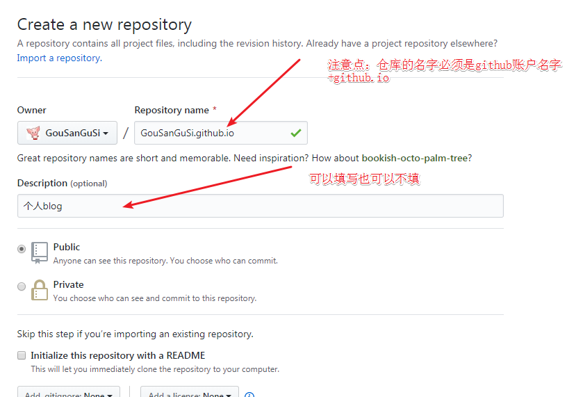

## Git 与Github 介绍

### 1.1 什么是git 有什么用？

Git 是一个版本控制管理工具：
- 保存历史记录(版本管理、版本回退)
- 多人协同交互

Git 翻译过来就是 饭桶 的意思，老外就是喜欢这样的命名。
### 1.2 安装和配置 Git 环境(最新版本2.25.1)

下载地址：https://git-for-windows.github.io/

历史版本地址：https://github.com/git-for-windows/git/releases

确认是否有 git 环境：

```bash
$ git --version
```

如果看到能输出一个版本号 `git version 2.20.1.windows.1`（版本不一定一致），说明没有问题。

```
$git config --list
```


###1.3申请一个 github 账号

- 打开 [github](httpd://github.com) 网站
- 点击 `sign up`
- 填写用户名、邮箱、密码
- 选择 free
- create
- 会收到一个邮件，去邮箱中点击验证

### 1.4 初始设置

```bash
设置用户名
$ git config --global user.name "yourname"
设置密码
$ git config --global user.email "your_email@example.com"
```
第一次安装了 git 环境之后配置一下即可。
如果想要修改，可以使用上面命令重新执行即可修改

### 1.5基本操作

- `git init` 初始化厂库
- `git status` 查看文件状态  *
- `git add *`    添加到git目录*
- `git commit -m "项目描述"` 提交到本地厂库*
- `git push`   提交到远程厂库*
- `git log`    查看提交日志*

### 1.6 推送至远程仓库

- `git push -u origin master`
  + 推送到名称为 origin 远程仓库地址下的 master 分支下


### 2.1 Git 与 github 关系
+ GitHub是个免费的代码托管平台
+ git 他是一个软件 是一个工具
+ Git 与GitHub 的关系？

git是一张弓，github是靶子，你的源代码是箭

### 资源共享

前端导航[https://ganjs.github.io/FrontEndGuide/]


## 第二块  hexo 博客搭建

##### 1、环境配置：

​	1.1 安装node 环境  如果已经安装过node环境了就不用再安装了   安装检测   node -v

​	出现版本号：v6.11.0

​	1.2 安装node环境的同时会自带npm 包    安装检测   npm -v   出现版本号：5.5.1

##### 2、NPM 工具介绍

2.1、NPM的简称：Node Package Manager

2.2、作用：是一个用来安装管理Node包和前端包的一个工具

- 3.1 一是托管node 环境或者浏览器环境用到的一些第三方的包
- 3.2 二是提供了一个用来共享或者检索的一个平台

2.3、是一共命令行工具可以用来下载npm网站上托管的包

##### 3、NPM 的基本使用

3.1、本地安装:

```bash
 npm install [--save]包名
```

- 注意：下载项目中使用的第三方包，要切换到项目的根目录，然后执行 `npm install jquery` 下载完成后包就在`node_modules`文件夹下
- 其中 `node_modules`文件夹中

3.2、全局安装：

- 在任意目录执行都可以

```bash
npm install -global 包名(工具名)
```

- 例子 比如全局安装less：

```
npm i -g  less(缩写)
```

- 可以通过 `npm root -g` 查看全局安装的目录

  #### 4、部署静态Blog

  4.1、 通过[hexo 来部署 网站](https://hexo.io/zh-cn/)

  4.2、 所需要的环境

  - Node 环境、 npm 全局安装  、github 账号

  4.3、安装hexo 环境 `npm install -g hexo-cli`

  - 检查是否安装成功：`hexo --version `,出现版本号则表示安装成功
- 
  

4.4、博客初始化 ` hexo init blog`


4.5、更改端口号：

  ```js
  hexo s -p 4001
  ```


##### 5、博客的发布

##### 5.0、新建厂库

- 在`github`中新建一个厂库，形式如图
  
  
  
##### 5.1、修改配置文件

  - 找到blog 文件夹，找到config 文件，找到  `deploy` 、 ` type: ` 设置成键值对的形式：;

  - 

  - ` type: git ` 

  - 在项目的根目录下（也就是说blog 下执行gitbash 命令 `npm install hexo-deployer-git --save`）  检测方式：

  - 

  - 在上面的基础上执行 `hexo deploy --generate`  或者是 `hexo d` 就可以提交成功了

  - 看到的结果是：

  - 

  - 通过用户名加github.io 就可以访问了 

  - 

- 部署的过程中注意blog 中文件夹的变化
  
    

#####           6、奇淫技巧：修改时间

​	1、用命令生成md 文件：hexo new  "名字"

​	

​	2、在下次提交的时候要先执行


然后再进行


##### 	7、购买域名   +  域名解析

域名购买+解析如果有需求咱们再说

## 第三块  函数部分

##### 1、函数防抖与函数节流

​		1.1 什么是函数节流：  一个函数执行一次后，只有大于设定的执行周期后才会执行第二次，比如一个需要频繁触发的函数，出于对想能优化的角度，在规定的时间内，只让函数触发的第一次生效，后面的不生效

​		     1.1.0 应用场景： 函数节流的应用场景一般是onresize，onscroll等这些频繁触发的函数 

```javascript
  function thorttle(fn, delay) {
      var lastTime = 0;
      return function(){
        var nowTime = Date.now()
      if (nowTime - lastTime > delay) {
        fn()
        lastTime = nowTime
      }
      }

    }
    document.onscroll = thorttle(function(){console.log('scroll执行了'+Date.now())},4000)

```


​	1.2  什么是函数防抖：一个需要频繁触发的函数，在规定的时间内，只让最后一次生效，前面的不生效

​			1.2.0 应用场景： 频繁操作点赞和取消点赞，因此需要获取最后一次操作结果并发送给服务器 

```javascript
 // 需要两个参数  一个是函数，一个是时间
    function deboull(fn, delay) {
      var timeId = null;
      return function () {
        clearTimeout(timeId);
        timeId = setTimeout(function () {
          fn()
        }, delay)
      }

    }
    document.querySelector('button').onclick = deboull(function(){console.log('点击事件执行了')},1000)
```


##### 2、函数柯里化

​	什么是函数柯里化：

 所谓"柯里化"，就是把一个多参数的函数，转化为单参数函数。 

点到为止