# mysql数据库

## 数据库简介

### 什么是数据库

保存和管理数据的仓库，数据库。

什么是数据：文件，图片，视频，订单，用户名，密码等等。这些数据都需要有专门的地方来保存和管理。

在我们没有学习数据库技术之前，我们使用的数据都是以文件系统（db.json）的方式保存的。我们需要一个专门的软件来管理我们的数据, 这就是数据库。

数据库软件可以大致分成两大阵营

- 关系型数据库，代表产品：
  - **MySQL**
  - Oracle
  -  Sql server
  - DB2
- 非关系型数据库
  - redis 键值存储数据库
  - HBaise列存储数据库
  - **mongodb** 面向文档数据库
  - neo4j 图形数据库
  - Elasticsearch 搜索引擎存储

参考：数据库使用排名 <https://db-engines.com/en/ranking>

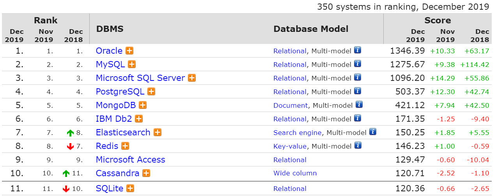

### 理解关系型数据库

在关系型数据库中，存在三级关系：

- 数据库
- 数据表
- 字段

数据表的结构和**excel**一模一样：


- 每一列都是一类数据 --- `字段`
- 每一行代表一条数据 --- `记录`

 

| 数据库       | excel文件                |
| ------------ | ------------------------ |
| 数据库       | excel文件                |
| 数据表       | excel文件中的某一个sheet |
| 表结构：字段 | sheet中的表头：列        |


### MySQL简介


MySQL是一个关系型数据库管理系统，由瑞典MySQL AB 公司开发，目前属于 Oracle 旗下产品 。MySQL所使用的 SQL 语言是用于访问[数据库](https://baike.baidu.com/item/数据库/103728)的最常用标准化语言。

- 体积小、速度快、总体拥有成本低，一般中小型网站的开发都选择 MySQL 作为网站数据库。
- 搭配 [PHP](https://baike.baidu.com/item/PHP) 和 [Apache](https://baike.baidu.com/item/Apache) 可组成良好的开发环境。


### 安装MySQL

- 单独安装mysql

  - 官网下载：<https://www.mysql.com/downloads/>

- 集成安装

  由于mysql,apache,php是经典的开者伙伴，市面上有很多的集成环境（一个大的软件，其中已经配置好了这三个软件），我们也可以使用它们。优点在于：基本不需要配置，使用比较方便。这样的集成环境有：

  - wampserver

  -  `phpstudy`

  - appserver

我们以phpstudy为例，去官网下载安装。值得提醒的是，当我们安装完MySQL后，我们的计算机又变成服务器了，不过不是Web服务器，而是MySQL数据库服务器了。

### 使用mysql数据库

mysql数据库安装完成之后（用集成环境wampserver代替单独的mysql），我们就可以去使用它了，你可以有很多方法去使用：

- 命令行窗口

  

密码一般是 root, 或者是123456

- 图形化界面
  - phpmyadmin
  - navicat
  - mysql-front


## mysql-front中操作数据库

### 新建数据库


在弹出的窗口中填写数据库名即可。


### 新建数据表


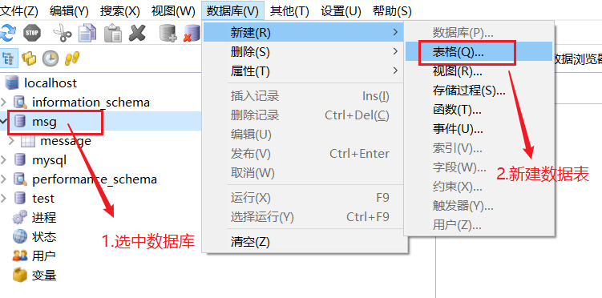


得到的效果如下：


### 添加字段


得到如下：

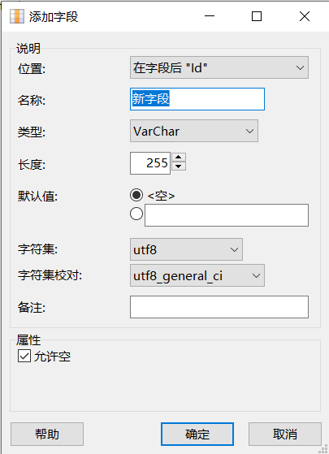

### 添加数据

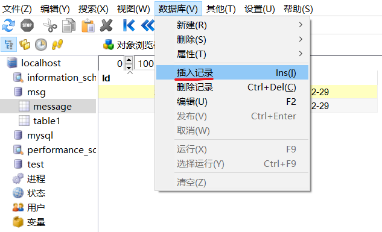

## 在phpmyadmin中操作数据库


### 新增数据库


### 新增表并设置表结构

- 一个数据库中可能有很多张表
- 每张表都有一个特殊的字段，这个字段可以用来把一条记录和其他记录区别开。这个具备这特性的字段叫表的主键。
- 每个字段都可以有自己的数据类型，就像变量有数据类型一样。
  - varchar:可变长字符串
  - int：整型


### 添加数据


### 查看数据

### 执行sql

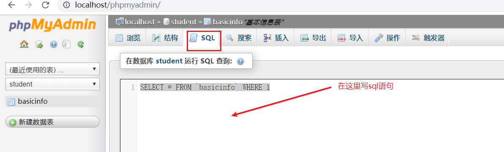


## 使用navicat操作mysql数据库

navicat是另一个独立的软件，它可以用来连接


### 连接MySQL服务器

① 点击“链接”按钮 ---  选择要链接的数据库种类

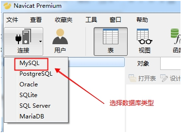

 ② 配置链接信息

   用户名： root          该用户是MySQL服务器系统的最高用户，拥有该系统的所有权限
   密码：  root             phpstudy中MySQL系统root用户的默认密码

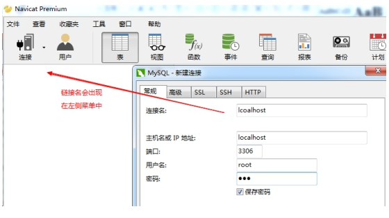

**保存**

  ③ 上图的连接名称是localhost，所以这里点击“localhost”结果

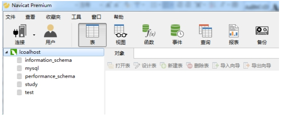

 

左侧的localhost下的内容都是数据库名称。

  `information_schema、mysql、performance_schema 这三个是系统数据库（千万别动）`
其他的都是自建数据库

看到上图，说明已经使用navicat 客户端正常链接到了 MySQL服务器了。

### 新建数据库

在 'localhost' 上点击鼠标右键， 选择 '新建数据库'

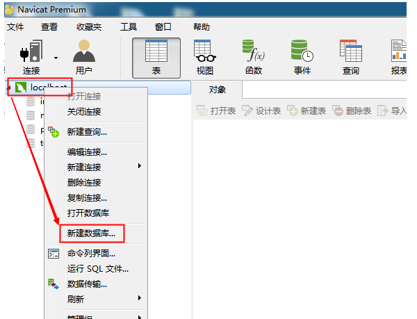

 

填写数据库名称 和 字符集（建议设置，也可以不设置）


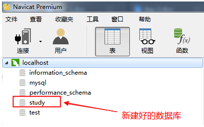


### 使用navicat创建数据表

双击 'study' --->  '表'（右键） --->  '新建表'

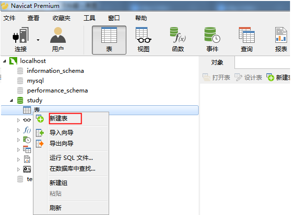


设置数据表的字段名、数据类型


设置几个字段


- id 学号，唯一
- name  姓名
- age  年龄
- sex 性别
- hobby 爱好
- height 身高
- weight 体重

主键： 有两个特点（唯一，非空），能够定位到唯一的一行数据

自动递增： 数字自增长

保存后使用F5刷新，能够看到新建好的表


下面添加一些数据：


## SQL语句

结构化查询语言(Structured Query Language)简称SQL，用来操作关系型数据库：

- 是一种数据库查询和程序设计语言，用来存取数据以及查询、更新、和管理关系型数据库。

- 数据库脚本文件的扩展名。


常用的sql语句有四类，分别对应对数据的四种操作：

- 增(create）(用户注册)
- 删(delete)  （删除订单）
- 改(update)  （修改密码）
- 查(read)  （搜索，用户登陆）


### 添加数据

格式: 

```SPARQL
 insert into 表名(字段名1，字段名2,....)  values (值1，值2，....)
```

 注意: 

- 字段的顺序要和值的顺序是完全匹配的
- 字段列表可以不与真实数据表中的字段完全相等，
  - 可以省略一些不必要的字段
  - 顺序与不需要与定义表时的顺序一致
-  如果是字符串类型的字段，其值要加""，如果是数值类型的字符串，其值不需要加“”

示例:

```sql
insert into stu (sex, weight, name) values ('男', 60, '庞凯')
```

### 删除数据

格式: 

```
 delete  from 表名  where 删除条件
```

注意：

- 不指定条件将删除所有数据

示例：

```sql
-- 删除id为14的同学
delete from stu where id=14

-- 删除的时候，不加条件，将删除stu表中的全部记录
delete from stu
```


### 修改数据

格式:  

 ```
update 表名 set 字段1=值1, 字段2=值2,...  where 修改条件
 ```

注意：

	- 要修改的值使用键值对来表示 
	- 多个字段用,分隔
	- 不指定条件，将修改当前表中全部的记录


示例：

```sql
-- 修改id为1的同学的年龄为53
update stu set age=53 where id = 1

-- 修改id为1的同学的年龄为35，身高为160
update stu set age=35,height=160 where id = 1

-- 如果修改的时候，不加条件，则会修改全部的数据
update stu set weight = 60

```


### 数据查询

格式: 

```
SELECT  字段名1, 字段名2, .....  FROM 表名	WHERE <条件表达式>
```

示例：

 ```sql
# 查询部分字段
SELECT id,name,age FROM stu
# 查询所有字段
SELECT * FROM stu
# 带条件的查询
SELECT * FROM 表名 WHERE 条件1 and 条件2
 ```


## SQL 高级查询(了解)

### where子句

select  field1, field2... from 表名  查询表中的所有数据

  where 可以使用条件来筛选查询出的结果

 

 ```sql

-- 查询所有的学生
select * from stu

-- 查询所有学生的id，name，height
select id,name,height from stu

-- 带条件的查询
select * from stu where 条件

-- 查询所有的男同学
select * from stu where sex='男'

-- 查询年龄大于50的同学
select * from stu where age > 50

-- 查询年龄大于50岁的男同学
select * from stu where age>50 and sex='男'

-- 查询年龄在30~60之间的同学，包括30和60
select * from stu where age>=30 and age<=60
select * from stu where age between 30 and 60
 ```


案例3: 查询学号为2的学生的所有信息

表： stu

字段： 所有字段  *

筛选条件：  id=2

```sql
select * from stu where id = 2
# 相等判断，写一个等号
```


案例4: 查询年龄大于等于25的学生的学号、姓名、年龄

表： stu

字段： id,name,age

筛选条件： age>=25

```sql
select id,name,age from stu where age >= 25
```


案例5: 查询年龄在23-28之间的学生的所有信息

表： stu

字段： *

筛选条件： 

```sql
select * from stu where age >= 23 and age <= 28

select * from stu where age between 23 and 28
```


### 模糊查询

通配符:

  %: 代表任意长度(包括0)的任意字符

  _:  代表1位长度的任意字符

```
a%b :  ab  abb  asdfb
a_b: acb  atb 
a_b%:  acb  a&baaad

```

like: 在执行模糊查询时，必须使用like来作为匹配条件

```sql
-- 模糊查询
-- 查询姓王的同学
select * from stu where name like '王%'

-- 查询姓王的同学，要求完整的姓名必须是三个字
select * from stu where name like '王__'

-- 查询名字中带有王的人
select * from stu where name like '%王%'
```


### 查询结果排序

order by 可以对查询结果按某个字段进行升序或者降序排列

  升序 asc （默认值） ，  降序 desc 

可进行排序的字段通常是  整型  英文字符串型  日期型  (中文字符串也行,但一般不用)

```sql
-- select * from stu order by 字段 排序方式, 字段 排序方式
-- 查询所有的学生，按年龄升序排列
select * from stu order by age asc
select * from stu order by age

-- 查询所有的学生，按年龄降序排列
select * from stu order by age desc

-- 查询所有的学生，先按身高升序排列，如果身高相同再按id降序排列
select * from stu order by height asc, id desc

-- 查询所有的男同学，并按年龄降序排列
select * from stu where sex='男' order by age desc

```

注意：如果SQL语句中，有where和order by，where一定要放到order by之前


### 限制查询结果

limit 用来限制查询结果的起始点和长度

 格式:  limit  start, length

 start: 起始点。 查询结果的索引，从0开始。 0代表第一条数据。如果省略start，则默认表示从0开始

 length: 长度

```sql
-- 查询前3个同学
-- select * from stu limit 0, 3

-- 查询第3到第5名同学
-- select * from stu limit 2,3

-- 查询年龄最大的三个同学
-- select * from stu order by age desc limit 0,3

-- 查询年龄最大的三个男同学
-- select * from stu where sex='男' order by age desc limit 0,3
select * from stu where sex='男' order by age desc limit 3
```

注意：where、order by、limit如果一起使用，是有顺序的，where在最前面、其次是order by、limit要放到最后==。


### 连接查询

连接查询意思是将两个表或更多张表连接到一起查询。查询的结果一般会包含有两个表的全部结果。

不是说任意的两个表都可以连接查询；能够连接查询的两个表必须有关系才行。

连接查询的语法：

```mysql
select * from 表1 , 表2 where  两个表的关系
```

创建两个表:类别表和文章表：

```
// 类别表
CREATE TABLE IF NOT EXISTS `categroy` (
  `id` int(11) NOT NULL AUTO_INCREMENT,
  `name` varchar(10) NOT NULL,
  `slug` varchar(10) NOT NULL,
  PRIMARY KEY (`id`)
) ENGINE=InnoDB  DEFAULT CHARSET=utf8 COMMENT='文章类型表' AUTO_INCREMENT=1;
```


```
//文章表
CREATE TABLE IF NOT EXISTS `article` (
  `id` int(11) NOT NULL AUTO_INCREMENT,
  `cateid` int(11) NOT NULL,
  `title` varchar(20) NOT NULL,
  `content` varchar(50) NOT NULL,
  `dt` timestamp NOT NULL DEFAULT CURRENT_TIMESTAMP ON UPDATE CURRENT_TIMESTAMP,
  PRIMARY KEY (`id`)
) ENGINE=InnoDB  DEFAULT CHARSET=utf8 COMMENT='文章表' AUTO_INCREMENT=1;
```

这两个表的关系是 category.id = article.cateid

```bash
//插入数据
insert into article (cateid,title,content) value(1,"我要拿什么爱你","我要拿什么爱你呢？");
insert into categroy (name,slug) value ('科学','kexue');
//选出数据
 select article.id,title,content,name,dt from article,categroy where article.cateid=categroy.id;
```


## 附：mysql命令行

启动mysql命令行工具，就使用sql来操作数据库啦。

### 显示所有数据库

`show databases;`

### 创建数据库

`create database 数据库名;`

### 使用某个数据库

`use 数据库名；`

### 建立数据表

格式：

```
create 表名(
字段名 类型（长度） 是否可为空 其它修饰
)
```

示例：

```
CREATE TABLE IF NOT EXISTS `student` (
  `id` int(11) NOT NULL AUTO_INCREMENT,
  `sno` int(11) NOT NULL,
  `sname` varchar(10) NOT NULL,
  `sage` varchar(50) NOT NULL,
  `sgender` varchar(50) NOT NULL,
  PRIMARY KEY (`id`)
) ENGINE=InnoDB  DEFAULT CHARSET=utf8 COMMENT='学生表' AUTO_INCREMENT=1;
```

### 显示数据表

`show tables;`

### 修改表名

`rename table 原表名 to 新表名；`

### 删除数据库

`drop database if exists school; `

//如果存在SCHOOL则删除

### 删除数据表

`drop table 数据表名;`


### 查看表结构

`desc tabl_name;`


### phpstudy中文乱码


# node操作mysql

通过mysql这个包来操作mysql数据库。mysql模块是一个第三方模块，专门用来操作MySQL数据库。 

```shell
# 安装
npm i mysql
```

## 基本用法

参考：https://www.npmjs.com/package/mysql#introduction

### 直接使用

1.直接使用：

一共需要5个步骤：

1) 加载 MySQL 模块

2) 创建 MySQL 连接对象

3) 连接 MySQL 服务器

**4) 执行SQL语句**           

5) 关闭链接。

```javascript
var mysql      = require('mysql');
var connection = mysql.createConnection({
  host     : 'localhost',
  user     : 'me',
  password : 'secret',
  database : 'my_db'
});
 
connection.connect();
 
connection.query('SELECT 1 + 1 AS solution', function (error, results, fields) {
  if (error) throw error;
  console.log('The solution is: ', results[0].solution);
});
 
connection.end();
```


参考地址： https://www.npmjs.com/package/mysql#introduction 

### 使用连接池

```
var mysql = require('mysql');
var pool  = mysql.createPool({
  connectionLimit : 10,
  host            : 'example.org',
  user            : 'bob',
  password        : 'secret',
  database        : 'my_db'
});
 
pool.query('SELECT 1 + 1 AS solution', function (error, results, fields) {
  if (error) throw error;
  console.log('The solution is: ', results[0].solution);
});
```

参考地址： https://www.npmjs.com/package/mysql#pooling-connections 

### 查询

执行查询类型的SQL语句，查询结果（result）是一个数组，每个单元是对象，对象的属性是数据表的字段名。


```js
// 1. 加载mysql
const mysql = require('mysql');
// 2. 创建连接对象
const conn = mysql.createConnection({
    // 对象的属性名字不能改变
    host: 'localhost',
    port: 3306,
    user: 'root',
    password: 'root',
    database: 'qishiliu'
});
// 3. 连接到MySQL服务器
conn.connect();
// 4. 执行SQL语句
let sql = 'select id,name,age from stu';
conn.query(sql, (err, result, fields) => {
    if (err) throw err; // throw err 相当于 return console.log(err);
    console.log(result); // result就是查询结果
});
// 5. 关闭连接，释放资源
conn.end();
```


###  添加

执行添加类型的SQL语句，查询结果（result）是一个对象，该对象中有两个属性要关注：

- affectedRows： 受影响行数
- insertID： 查询数据的主键值

占位符形式：

  数据添加时，占位符需要一个对象。 对象的属性是数据表字段名，值是要写入数据表的数据

```js
const mysql = require('mysql');
const conn = mysql.createConnection({
    host: 'localhost',
    port: 3306,
    user: 'root',
    password: 'root',
    database: 'qishiliu'
});
conn.connect();

let sql = 'insert into users (name,password) values("小王","snv")'
conn.query(sql, (err, result) => {
    if (result.affectedRows > 0) {
        console.log('添加成功，新数据的id为：' + result.insertId);
    } else {
        console.log('添加失败');
    }
});

conn.end();
```

### 修改

执行修改类型的SQL语句，查询结果（result）是一个对象，该对象中有 affectedRows 属性，表示本次修改操作影响到的行数。

```js
const mysql = require('mysql');
const conn = mysql.createConnection({
    host: 'localhost',
    port: 3306,
    user: 'root',
    password: 'root',
    database: 'qishiliu'
});
conn.connect();

// 更新
// update stu set 字段=值,字段=值 where id=11
let sql = 'update users set password="123" where name="小王"';

conn.query(sql, (err, result) => {
    if (err) throw err;
    if (result.affectedRows > 0) {
        console.log('修改成功');
    } else {
        console.log('修改失败');
    }
});

conn.end();
```

### 删除

执行删除类型的SQL语句，查询结果（result）是一个对象，该对象中有 affectedRows 属性

```js
const mysql = require('mysql');
const conn = mysql.createConnection({
    host: 'localhost',
    port: 3306,
    user: 'root',
    password: '',
    database: 'qishiliu'
});
conn.connect();

// 删除
let sql = 'delete from stu where id=1';

conn.query(sql,(err, result) => {
    if (err) throw err;
    if (result.affectedRows > 0) {
        console.log('删除成功');
    } else {
        console.log('删除失败');
    }
});

conn.end();
```


## 模块化封装

分析上面几个单独的功能点，它们基本的语法格式是一致的，只是要执行的sql语句不同而已，所以，我们可以对它们进行一个简单的封装。然后再写测试文件对其进行测试。

涉及两个文件：

- sqltool.js
- sqltooltest.js

### 回调函数封装

模块名：sqltool.js

```javascript
function exeSql(sql, callback) {
  var mysql = require('mysql');
  var connection = mysql.createConnection({
    host: 'localhost',
    user: 'root',
    password: 'root',
    database: 'message' //你要连接的数据库名字
  });

  connection.connect();
  // 检查  用户名 小王，密码 123 是否正确
  // let sql = 'select * from users where username="小王" and userpassword="123"';
  connection.query(sql, function(error, results, fields) {
    // fields,表示本次操作涉及的字段

    callback(error, results);
  });

  connection.end();
}

//导出模块
module.exports = {
  exeSql
};

```

这上面这个模块中，就定义了一个函数exeSql。它接收两个参数：参数1是要执行的sql语句；参数2是回调函数。

额外写一个测试文件 sqltooltest.js

```javascript
const sqltool = require('./sqltool');

// sqltool.exeSql('select * from users', (err, data) => {
//   console.log(err);
//   console.log(data);
// });

sqltool.exeSql('select * from users where username="小美1" and userpassword="666"', (err, data) => {
  console.log(err);
  console.log(data);
  if (data.length > 0) {
    console.log('用户名密码Ok');
  } else {
    console.log('用户名密码error');
  }
});

```


### 改用 promise来封装


```
/**
 *
 * @param {*} sql 要执行的sql语句
 * @param {*} callback sql执行完成之后的回调函数
 *
 * demo:
 * 
    let sql = 'select * from users where username="小花" and userpassword="456"';

    exeSql(sql, function(err, data) {
    if (err) {
        console.log('err');
    } else {
        console.log(data);
    }
    });
 */

function exeSql(sql, callback) {
  var mysql = require('mysql');
  var connection = mysql.createConnection({
    host: 'localhost',
    user: 'root',
    password: 'root',
    database: 'message' //你要连接的数据库名字
  });

  connection.connect();
  // 检查  用户名 小王，密码 123 是否正确
  // let sql = 'select * from users where username="小王" and userpassword="123"';
  connection.query(sql, function(error, results, fields) {
    // fields,表示本次操作涉及的字段

    callback(error, results);
  });

  connection.end();
}

function exeSqlPromise(sql) {
  var p = new Promise((resolve, reject) => {
    var mysql = require('mysql');
    var connection = mysql.createConnection({
      host: 'localhost',
      user: 'root',
      password: 'root',
      database: 'message' //你要连接的数据库名字
    });

    connection.connect();
    // 检查  用户名 小王，密码 123 是否正确
    // let sql = 'select * from users where username="小王" and userpassword="123"';
    connection.query(sql, function(error, results, fields) {
      // fields,表示本次操作涉及的字段
      if (error) {
        reject(error);
      } else {
        resolve(results);
      }
    });
    connection.end();
  });
  return p;
}

//导出模块
module.exports = {
  exeSql: exeSql,
  exeSqlPromise: exeSqlPromise
};

```


# 改进留言板

## 登陆

1.安装mysql

2.引入自定义模块

sqltool.js

```
function exeSql(sql,callback) {
    // 用nodejs和mysql包 来 连接 mysql服务器上的数据库，并完成查询操作

    // 1. 先要安装包mysql
    // 2. 准备好mysql数据库，数据表

    //(1)引入包
    var mysql      = require('mysql');
    //(2)配置数据库连接
    var connection = mysql.createConnection({
    host     : 'localhost', // 数据库的主机地址
    user     : 'root',      // 连接数据库时，需要用到的用户名
    password : 'root',      // 连接数据库时，需要用到的密码
    database : 'message'    // 本次要连接的数据库
    });
    
    //(3)连接数据库
    connection.connect();
    
    //(4) 执行sql语句 重点
    // .query(sql语句，回调)
    // fs.readFile((err,data))
    connection.query(sql, function (err, data) {
        // err 表示本次查询是否有错误.如果没有错误它是null；有错误，就是错误本身
        // data 表示本次sql操作的结果。对于insert操作，结果是一个对象。affectedRows:本次受到影响的记录数
        // console.log(err);
        // console.log(data);
        callback(err,data)
        
    });
    // connection.query('SELECT 1 + 1 AS solution', function (error, results, fields) {
    //   if (error) throw error;
    //   console.log('The solution is: ', results[0].solution);
    // });
    
    connection.end();

}

// 导出模块
module.exports = {
    "exeSql": exeSql
}
// exeSql('insert into users(username,password) values("admin","admin")')
// exeSql('select * from users where username="小红" and password="admin"',function(err,data){
//     console.log(err);
//     console.log(data);
// })
// exeSql('delete from users where Id=8')
```


3. 修改登陆接口

serverExpress.js

```javascript

const express = require('express')
const bodyParser = require('body-parser')
const session = require('express-session');

// 引入自定义模块
const message = require('./message.js')

// 引入自定义模块
+  const sqltool = require('./sqltool')

const app = express();
//1. 引入session包

//2. 配置项
let conf = {
  secret: '123456', //加密字符串。 使用该字符串来加密session数据，自定义
  resave: false, //强制保存session即使它并没有变化
  saveUninitialized: false //强制将未初始化的session存储。当新建了一个session且未
  //设定属性或值时，它就处于未初始化状态。
};

//3. 使用express-session
app.use(session(conf));

app.use(bodyParser.urlencoded({extended:false}))

// 做静态资源托管
// app.use(express.static('public'))

app.use((req,res,next)=>{
    res.header('Access-Control-Allow-Origin', req.headers.origin); //需要显示设置来源
    res.header('Access-Control-Allow-Headers', 'Origin, X-Requested-With, Content-Type, Accept');
    res.header('Access-Control-Allow-Methods', 'PUT,POST,GET,DELETE,OPTIONS');
    res.header('Access-Control-Allow-Credentials', true); //带cookies
    next();
})

// 用户登陆
app.post('/login',(req,res)=>{
    let {name,password}= req.body;
    // todo 保存到数据库
    // sqltool.exeSql(sql语句，回调)
    let sql = `select * from users where username='${name}' and password='${password}'`
    
+    sqltool.exeSql(sql,(err,data)=>{
+        console.log(sql);
        
+        console.log(err);
+        console.log(data);
+        if(data.length === 1){
            // 设置session
+            req.session.loginname = name
+            console.log(req.session);
            
+            res.json( {code:200,msg:'登陆成功'})
+        } else {
            res.json( {code:500,msg:'登陆失败'})
+        }
+    })
    // if(name === 'admin' && password==='123'){
    //     // 设置session
    //     req.session.loginname = 'admin'
    //     console.log(req.session);
        
    //     res.json( {code:200,msg:'登陆成功'})
    // } else {
    //     res.json( {code:500,msg:'登陆失败'})
    // }
})

app.get('/checklogin',(req,res)=>{
    console.log('你的登陆名是：',req.session.loginname);
    if(req.session.loginname){
        // 登陆
        res.json({code:200,msg:'已登陆',loginname: req.session.loginname})
    } else {
        res.json({code:500,msg:'未登陆'})
    }
    // res.send( '你的登陆名是：' + req.session.loginname)
})

app.get('/quit',(req,res)=>{
    // 退出 删除session
    req.session.destroy();
    res.json({code:200,msg:'退出成功'})
})

app.get('/getmsg',(req,res)=>{
    let msgArr =  message.get();
    let obj = {code:200, msg:'获取成功',data: msgArr }
    
    res.json(obj)
})

app.post('/addmsg',(req,res)=>{
    if(req.session.loginname){
        let  obj = req.body
        obj.dt = Date.now();

        message.add(obj)
        res.json({code:200,msg:'添加成功', data:obj })
    } else {
        res.statusCode = 403
        res.json({code:500,msg:'没有权限'})
    }
})

app.listen(8000,()=>{
    console.log(8000);
})
```

# 2.注册

前端页面

```
<!DOCTYPE html>
<html lang="en">
  <head>
    <!-- Required meta tags -->
    <meta charset="utf-8" />
    <meta name="viewport" content="width=device-width, initial-scale=1, shrink-to-fit=no" />

    <!-- Bootstrap CSS -->
    <link rel="stylesheet" href="./assets/bootstrap.css" />
    <style>
      .login {
        width: 400px;
        margin: 50px auto;
      }
    </style>
    <title>留言板-用户注册</title>
  </head>
  <body>
    <div class="container">
      <div class="login shadow-sm p-5">
        <h3>留言板-用户注册</h3>
        <div class="form-group ">
          <label for="username">昵称</label>
          <input type="text" class="form-control" id="username" placeholder="昵称" />
        </div>
        <div class="form-group">
          <label for="password">Password</label>
          <input type="password" class="form-control" id="password" placeholder="Password" />
        </div>
        <div>
          <button class="btn" id="btn" type="button">注册</button>
        </div>
        <div class="text-right"><a href="./login.html">登陆</a> <a href="./index.html">主页</a></div>
      </div>
    </div>
    <script src="./jquery-1.8.1.js"></script>
    <script>
      
        // 1.获取用户名，密码
        // 2.判断是否为空
        // 3. 发请求
      $('#btn').click(function() {
        // 获取用户名，密码
        let name = $('#username').val().trim()
        let password = $('#password').val().trim()

        if(name === "" || password === ""){
          alert('不能为空')
          return
        }

        $.ajax({
          url:'http://192.168.165.74:8000/adduser',
          type:'post',
          crossDomain: true,
          xhrFields: {
              withCredentials: true
          },

          data: {
            name, password
          },
          success:function(res){
            console.log(res);
            if(res.code === 200){
              // 跳转
              alert('注册成功啦')
              location.href = "./login.html"
            } else {
              alert(res.msg)
            }
            
          }
        })
      });
      
    </script>
  </body>
</html>
```

后端接口

```

// 用户注册
app.post('/adduser',(req,res)=>{
    let {name,password}= req.body;
    // todo 添加到数据库
    // 检查这个名字是否被占用
    sqltool.exeSql(`select * from users where username='${name}'`,(err,data)=>{
        if(data.length > 0){
            // 说明名字占用
            res.json({code:500,msg:'注册失败,名字被占用'})
        } else {
            let sql = `insert into users(username,password) values('${name}', '${password}')`;
            sqltool.exeSql(sql,(err,data)=>{
                console.log(sql);
                
                console.log(err);
                console.log(data);
                // affectedRows:表示本次操作影响的记录行数。
                // 这里是添加一条记录
                if(data.affectedRows === 1){
                    res.json({code:200,msg:'注册成功'})
                } else {
                    res.json({code:500,msg:'注册失败'})
                }
            })
        }
    })  
})
```


