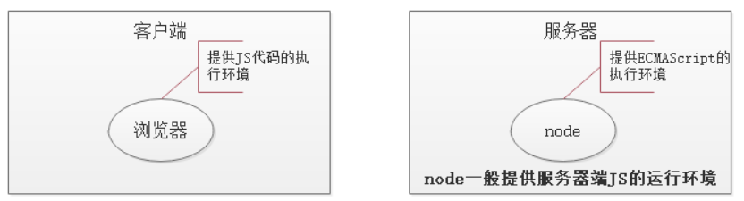
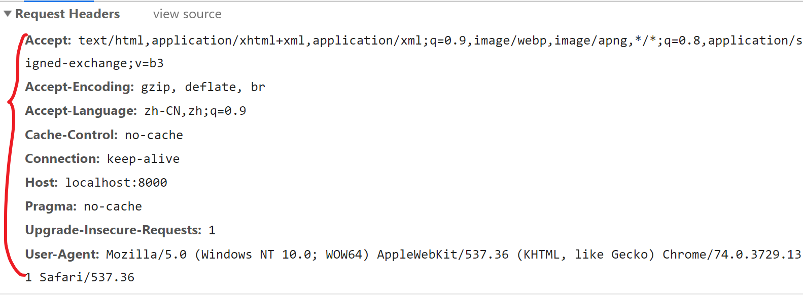
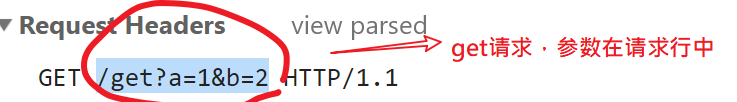
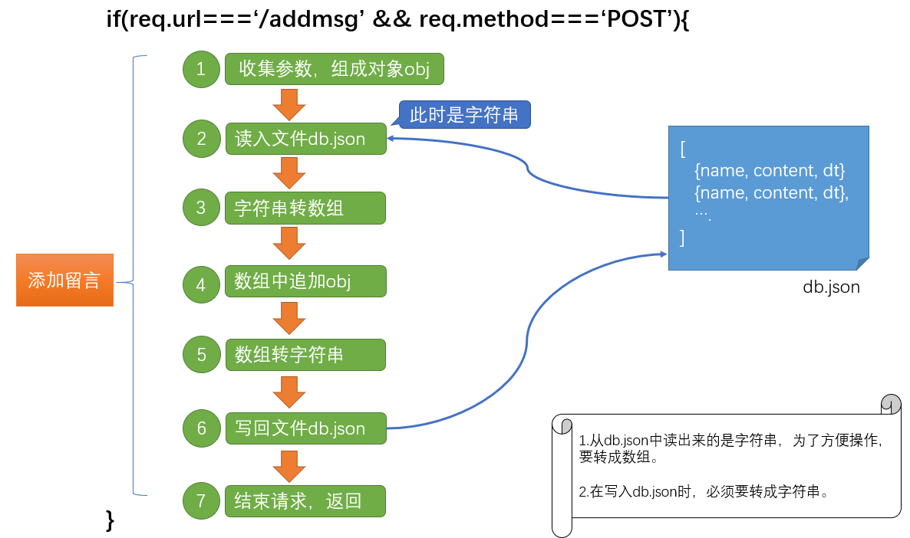
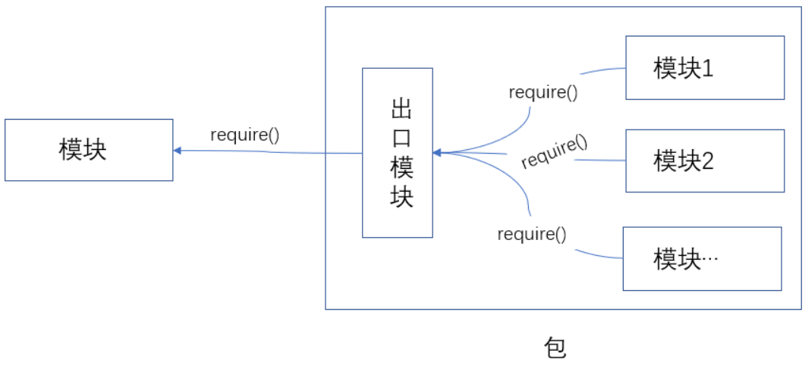
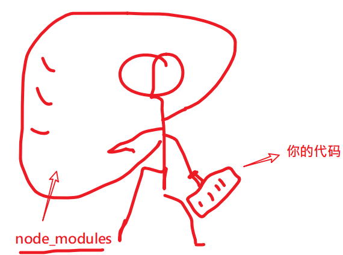
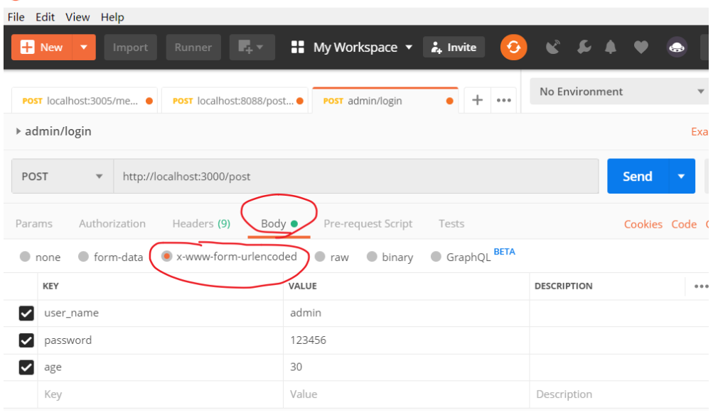
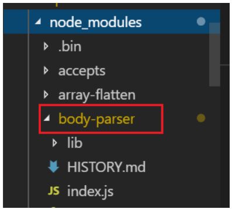
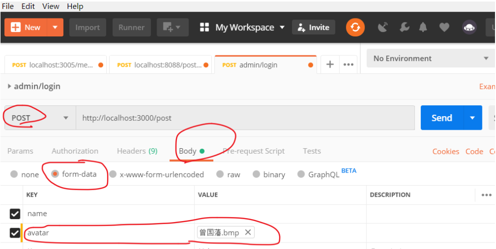
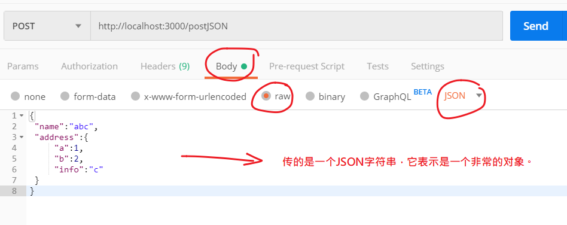

nodejs讲义

从前端到后端；扩展前端技能栈；


## 安装并使用nodejs

### 安装nodejs

#### 下载

官网： https://Nodejs.org/en/  中文网：http://Nodejs.cn/

- 版本说明

  - **LTS**： 长期稳定版(Long Term Support))。 项目开发建议使用长期稳定版
  - **Current**： 最新版。最新版包含了一些新功能，如果想学习最新的功能，则可以使用该版本。最新版可能会有一些未知的bug。


#### 安装

1) 双击安装文件开始安装（不同系统选择对应的安装文件）

2) 傻瓜式安装，一路 'next' 即可

注意：

- 建议安装目录所使用`英文路径`

#### 测试是否安装成功

打开任意一个**小黑窗**，输入`node  -v`能够看到Nodejs版本号即为安装成功。

- cmd窗口(window+R, --->运行-->录入cmd,回车)

- powershell（window10操作系统）

  

### 在node环境下运行js代码

我们前面的学习中，js代码都是在**浏览器**中运行的，现在开始学习nodejs后，我们有了第二个环境中可以运行js代码。

有两种方式可以运行js代码：

- 在nodejs 提供的repl中环境
- 单独执行外部的js文件

#### 方法1：在 REPL中运行

REPL(Read Eval Print Loop:交互式解释器) 表示一个电脑的环境，类似 Window 系统的终端或 Unix/Linux shell，我们可以在终端中输入命令，并接收系统的响应。

Node 自带了交互式解释器，可以执行以下任务：

- **读取** - 读取用户输入，解析输入了Javascript 数据结构并存储在内存中。
- **执行** - 执行输入的数据结构
- **打印** - 输出结果
- **循环** - 循环操作以上步骤直到用户两次按下 **ctrl+c** 按钮退出。

具体操作：

1. 在任意控制台中输入node 并回车确定，即可进行入node自带的REPL环境。
2. 此时，你可以正常写入js代码，并执行。
3. 如果**要退出，连续按下两次ctrl+c**


#### 方法2：执行一个JS文件

1. 请事先准备好一个js文件。
   - 例设这的路径是：e:/index.js
   - 具体内容是

```javascript
var a = 1;
console.info(a + 2);
```

2. 打开小黑窗，进入到这个文件的目录
   - 技巧:在资源管理器中按下shift，同时点击鼠标右键，可以选择在此处打开powershell/命令行窗口。
   - 
   - cd 命令可以用来切换当前目录。
   - 进入这个目录 后，直接在地址栏中写入 `cmd`也可以在小黑窗中切换到当前目录。
   
3. 接下来 通过  ` node js文件` 的格式来执行这个js文件。 例如：

```javascript
node index.js
```

注意:

- 执行js文件时，如果当前命令行目录和js文件**不在**同一个盘符下，要先切换盘符
- 执行js文件时，如果当前命令行目录和js文件**在**同一个盘符中，则可以使用相对路径找到js文件并执行

### nodejs的helloworld程序

下面，我们来通过一个最基本的http服务器程序来见识nodejs的作用。

第一步：新建一个文件，名为  `d:/http.js`( 文件名及路径名可以自行设置，建议均不使用中文字符)

第二步：在文件中录入如下代码。

```javascript
// 引入http模块
const http = require('http');

// 创建服务
const server = http.createServer(function(req, res) {
  console.log(`来自${req.connection.remoteAddress}的客户端在${new Date().toLocaleTimeString()}访问了本服务器`);
  res.end('<h1>hello world! very good!!</h1> <p>' + req.connection.remoteAddress + '</p>');
});
// 启动服务
server.listen(8081, function() {
  console.log('服务器启动成功，请在http://localhost:8081中访问....');
});
```

第三步：在小黑窗中进入到d盘根目录，键入命令 `node http.js`

第四步：打开一个浏览器页面，输入'http://localhost:8081'，观察效果

第五步：把localhost改成你自己电脑的ip地址，再把这个路径发你的同学来访问。

- 如果不能访问，有可能你需要手动关闭你自己计算机的防火墙。

## node.js基本介绍

### node.js是什么

> Node.js® is a JavaScript runtime built on [Chrome's V8 JavaScript engine](https://v8.dev/).
>
> ------
>
> Node.js® 是一个基于 [Chrome V8 引擎](https://v8.dev/) 的 JavaScript 运行时

- Node全名是Node.js，但它不是一个js文件，而是一个**软件**
- Node.js是一个基于Chrome V8引擎的ECMAScript的运行环境，在这个环境中可以执行js代码
- Node.js提供了大量的工具（API），能够让我们完成文件读写、Web服务器创建等功能。



### nodejs和浏览器和javascript的关系

#### nodejs和浏览器的关系

相同之处：

- 都可以运行js(严格来讲是ECMAScript)代码

不同之处：


- 安装了浏览器这个软件，它不但可以执行ECMAScript，浏览器这个软件内置了window对象，所以浏览器有处理DOM和BOM的能力。
- 安装了NodeJs这个软件，它不但可以执行ECMAScript，NodeJS这个软件也内置了一些东西，包括全局成员和模块系统，同时还可以载入第三方模块来完成更强大的功能。


#### nodejs和javascript的区别？

- nodejs是一个容器（**不是一个新语言**），ECAMScript程序可以在这个容器中运行。
  - 不能在nodejs使用window对象，也不能在nodejs使用dom操作。因为nodejs中并不包含这个对象。
- javascript是由三个部分组成：ECAMScrtipt,BOM,DOM

### 学习Nodejs的意义

在我们熟悉的浏览器上执行JS不是很好吗？为什么要学习Nodejs呢？主要原因：

- 大前端必备技能
- 使得JS能够和操作系统 “互动” （读取文件，写入文件等，管理进程）
- 为JavaScript提供了服务端编程的能力
  - 文件IO
  - 网络IO
  - 数据库
- 了解接口开发，进一步理解Web开发，了解后端同学的工作内容
- 能写：真的假接口。


### 学习的主要内容

不是学新语法，es6就是语法；

主要是学模块及模块的使用；

## node中的模块化

在项目的开发过程中，随着功能的不断增强，代码量，文件数量也急剧增加，我们需要把一个大函数拆成小函数，把一个大文件拆成小文件，把一个大功能拆成若干个小功能。这里很自然地就涉及到模块化的想法：一个复杂的系统分成几个子系统，体现在几个小的文件在一起组成一个大的文件，集成强大的功能。


遗憾的是es5不支持模块化：就是在一个js文件内不能引入其他js文件。不能通过一个大文件去集成若干个小文件。（不是说一个html文件中不能包含多个js文件）。


这样就会带来多个问题：

1. 文件的加载先后顺序
2. 不同的文件内部定义的变量共享


### 模块化

一个js文件中可以引入其他的js文件，能使用引入的js文件的中的变量、数据，这种特性就称为模块化。使用模块化开发可以很好的解决变量、函数名冲突问题，也能灵活的解决文件依赖问题。

- 以前

  es5不支持模块化，让前端人员很为难。为了让支持模块化，我们一般会借用第三方库来实现：

  - sea.js. https://www.zhangxinxu.com/sp/seajs/
  - require.js. https://requirejs.org/

- 现在
  - es6原生语法也支持模块化（并不表示浏览器也支持模块化）
  - Nodejs内部也支持模块化（与es6的模块化有些不同之处），具体的语法在后面来介绍

### nodejs中的模块

每个模块都是一个独立的文件。每个模块都可以完成特定的功能，我们需要时就去引入它们，并调用。不需要时也不需要管它。（理解于浏览器的js中的Math对象）

nodejs模块的分类

- 核心模块
  - 就是nodejs自带的模块，在安装完nodejs之后，就可以随意使用啦。相当于学习js时使用的Array对象。
  - 全部模块的源代码 https://github.com/nodejs/node/tree/master/lib
- 自定义模块
  - 程序员自己写的模块。就相当于我们在学习js时的自定义函数。
- 第三方模块
  - 其他程序员写好的模块。nodejs生态提供了一个专门的工具npm来管理第三方模块，后面我们会专门讲到。
  - 相当于别人写好的函数或者库。例如我们前面学习的JQuery库，arttemplate等。

#### 核心模块

> 官网文档 https://nodejs.org/dist/latest-v10.x/docs/api/
>
> 中文文档 http://nodejs.cn/api/
>
> 学会查 API，远远比会几个 API 更重要

- 核心模块就是 Node 内置的模块，需要通过唯一的标识名称来进行获取。
- 每一个核心模块基本上都是暴露了一个对象，里面包含一些方法供我们使用
- 一般在加载核心模块的时候，变量（或常量）的起名最好就和核心模块的标识名同名
  - 例如：`const fs = require('fs')`

示例：用fs模块读取文件

```javascript
const fs = require('fs');
let htmlStr = fs.readFileSync( 'index.html')).toString();
console.log(htmlStr)
```

注意：require()中直接写模块的名字

- 不要加.js
- 不要加其它路径


#### 第三方模块

所谓第三方模块，顾名思义，就是别人写的模块（不是自己写的，也不是nodejs自带的）。这一点和在浏览器环境中使用使用第三方函数或者是库非常类似 。一般有两步：

1. 去官网下载js文件。
2. 在自己的html页面中引入。

以jquery为例

1. 去jquery官网中下载jquery.js文件。
2. 在html页面中使用 script link标签引入这个js文件
3. 开始使用啦

这个过程中很容易，我们也慢慢习惯了，但这种使用方式是有问题的：

- 随着引入的第三方库越来越多，你得每一个库都去他们各自的官网上下载，引入10个库，都得下载10次
- 各个库的版本号在升级更新时，你也无法准确得知。

> 阿爷无大儿，*木兰*无长兄，愿为市鞍马，从此替爷征。
> 东市买骏马，西市买鞍鞯，南市买辔头，北市买长鞭。旦*辞*爷娘去，暮宿黄河边，不闻爷娘唤女声，但闻黄河流水鸣溅溅。旦*辞*黄河去，暮至黑山头，不闻爷娘唤女声，但闻燕山胡骑鸣啾啾。

木兰词中所述的场景：木兰替父从军，要买参战装备要四处奔走。我们做个效果，要实现某个功能，要四处下载包，难到就没有一个类似于京东超市一样的地方，可以实现一站式配齐吗？

有，这个超市就是 大名鼎鼎的 `npm`。 在node中，我们通过npm来解决下载、使用、管理第三方模块的问题。

 

## fs模块

fs模块是nodejs用来进行文件操作的模块。fs是 FileSystem的简写。它属于核心模块，你引入之后就可以直接使用了。

官方手册：http://nodejs.cn/api/fs.html

使用步骤：

1. 引入模块

   ```javascript
   // 引入模块
   const fs = require('fs');
   // 可以使用var、let，但是建议使用const，因为我们不希望它被改变。
   // 名字不必大写成FS，一般也就叫fs这个名字。
   ```

2. 调用api实现自己的要求

   ```javascript
   fs.apiName()
   ```

   

fs模块中操作文件(或者文件夹)的方法，大多都提供了两种选择：

- 同步版本的
- 异步版本的

### 文件内容读取 - readFile

#### 异步格式

```js
fs.readFile('文件路径'[,选项], function (err, data) {
  if (err) throw err;
  console.log(data);
});
```

说明：

- 参数1：文件路径。 相对路径和绝对路径均可。
- 参数2： 配置项，可选参数，可不写。主要用来配置字符集。一般可设置为'utf8'

​      如果不设置该参数，文件内容会Buffer形式返回。

- 参数3: 读取完成后触发的回调函数。这个回调函数在读完文件后自动被nodejs自动调用，并传入 err 和 data

  - 如读取成功

    - err: null

    - data: 文件内容，如果不设置参数2,则返回二进制数据。可以使用 toString() 方法将二进制数据

      转为正常字符串

  - 如读取失败

    - err: 错误对象
    - data: undefined

示例：

```javascript
const fs = require("fs")
fs.readFile('文件路径',"utf8", (err, data) => {
  if (err) throw err;
  console.log(data);
});
```

#### 同步格式

与异步格式不同在于：

- api的名字后面有Sync（async是异步的，sync表示同步的）
- 不是通过回调函数来获取值，而是像一个普通的函数调用一样，直接获取返回值

```javascript
const fs = require("fs")
let rs = fs.readFileSync('文件路径',"utf8");
console.log(rs)
```


### 文件写入 

#### 覆盖写入 writeFile

功能：向指定文件中写入字符串（覆盖写入）， 如果没有该文件则尝试创建该文件。它把把文件中的内容全部删除，再填入新的内容。

格式：

```javascript
fs.writeFile(pathName, content, option, callback);
参数1: 要写入的文件路径 --- 相对路径和绝对路径均可，推荐使用绝对路径
参数2: 要写入文件的内容
参数3: 配置项，设置写入的字符集，默认utf-8
参数4: 写入完成后触发的回调函数，有一个参数 --- err （错误对象）
```

示例

```javascript
const fs = require('fs')
fs.writeFile('./a.txt', 'hello world niahi \n 换一行', err => {
  if (err) {
    console.info(err)
    throw err
  }
})
```


#### 文件追加 appendFile

功能 ：向指定文件中写入字符串（追加写入）， 如果没有该文件则尝试创建该文件。


格式：

```
fs.appendFile(pathName, content, option, callback);
参数1: 要写入的文件路径 --- 相对路径和绝对路径均可，推荐使用绝对路径
参数2: 要写入文件的字符串
参数3: 配置项，设置写入的字符集，默认utf-8
参数4: 写入完成后触发的回调函数，有一个参数 --- err （错误对象）
```

示例：

```javascript
const fs = require('fs')

fs.appendFile('./a.txt', '\n 为天地立命', err => {
  if (err) {
    console.info(err)
    throw err
  }
})
```


### 路径问题

`在读取文件时，写相对路径是容易出问题的`。下面我们来看会出什么问题。

假设有如下两个文件，它们所处的目录及文件名如下所示：

```
day02/02code-nodejs/03.fs.js
day02/02code-nodejs/03.fs.txt
```

03.fs.js代码的作用是读出03.fs.txt中的内容，并显示出来。由于03.fs.js和要读取的目标03.fs.txt是在同级目录下，所以可以写相对路径始下：

```javascript
// 文件 fs.js
const fs = require('fs');
fs.readfilesync("./03.fs.txt",'utf8'); 
//注意这里对text.txt的访问使用的是相对"fs.js" 本身的路径
```


现在，我们想要运行03.fs.js这个文件有多种方式，根据当前处在的位置不同：

- 如果终端中的路径定位在`day02/02code-nodejs目录下，则通过`node 03.fs.js`

- 如果终端中的路径定位在`day02`目录下，则通过：`node 02code-nodejs/03.fs.js` 

  此时就不能正确找到文件了。

我们分析一下这个问题： 我们在fs中读取文件时，由于使用的是相对路径，所以在读这个文件的时，nodejs会去这里：`运行命令的小黑窗的路径 + 代码中的相对路径` 找它。而由于我们通过cd命令修改了运行这个js文件的小黑窗的路径，所以导致nodejs不能找到这个文件了。

解决方法: 就是在操作文件时，使用**绝对路径**来定位文件。

#### \__dirname __filename 获取绝对路径

相对与路绝位置在前面的学习中也有涉及，例如a标签的 href ，img标签的src属性在写入值时都可以写相对或者绝对地址。

例如：

```html
<a href="./index.html">相对地址</a>
<a href="https://www.baidu.com/index.html">绝对地址</a>
```


这里提到的

> 绝对路径： 从磁盘根目录开始到指定文件的路径。
>
> 相对路径：是以某个文件的位置为起点，相对于这个位置来找另一个文件。

nodejs中提供了两个全局变量来获取获取绝对路径：

- __dirname：获取当前被执行的文件的文件夹所处的绝对路径
- __filename：获取当前被执行的文件的绝对路径

全局变量的含义是：

- 变量：它们的值是变化的。在不同的文件中值就不同。
- 全局：在任意地方都可以直接使用。

#### path模块

官网文档地址：http://nodejs.cn/api/path.html#path_path 。它是也是node中的核心模块，作用是用来处理路径问题：拼接，分析，取后缀名等等。

 使用步骤：

1. 引入模块。

```
const path = require('path')
```

2. 使用模块。

下面是几个常用的api。

- path.basename（） ：此方法返回 `path` 的最后一部分。一般可用来获取路径中的文件名。

- path.join() ：路径拼接。
- path.parse(path) ：把一个路径转成一个对象

示例

```javascript
path.basename('/foo/bar/baz/asdf/quux.html');// 返回: 'quux.html'
path.basename('/foo/bar/baz/asdf/quux.html', '.html');// 返回: 'quux'
path.dirname('/foo/bar/baz/asdf/quux');// 返回: '/foo/bar/baz/asdf'
path.extname('index.html');// 返回: '.html'
```

注意：不考虑其中地址是否真的存在，只是单纯调用方法，获取结果。

### 附：fs模块中的常用方法

| API                                         | 作用              | 备注           |
| ------------------------------------------- | ----------------- | -------------- |
| fs.access(path, callback)                   | 判断路径是否存在  |                |
| fs.appendFile(file, data, callback)         | 向文件中追加内容  |                |
| fs.copyFile(src, callback)                  | 复制文件          |                |
| fs.mkdir(path, callback)                    | 创建目录          |                |
| fs.readDir(path, callback)                  | 读取目录列表      |                |
| fs.rename(oldPath, newPath, callback)       | 重命名文件/目录   |                |
| fs.rmdir(path, callback)                    | 删除目录          | 只能删除空目录 |
| fs.stat(path, callback)                     | 获取文件/目录信息 |                |
| fs.unlink(path, callback)                   | 删除文件          |                |
| fs.watch(filename[, options]\[, listener])  | 监视文件/目录     |                |
| fs.watchFile(filename[, options], listener) | 监视文件          |                |
| fs.existsSync(absolutePath)                 | 判断路径是否存在  |                |

### 附：path模块其它方法列表

| 方法                       | 作用                               |
| -------------------------- | ---------------------------------- |
| path.basename(path[, ext]) | 获取返回 path 的最后一部分(文件名) |
| path.dirname(path)         | 返回目录名                         |
| path.extname(path)         | 返回路径中文件的扩展名(包含.)      |
| path.format(pathObject)    | 将一个对象格式化为一个路径字符串   |
| path.join([...paths])      | 拼接路径                           |
| path.parse(path)           | 把路径字符串解析成对象的格式       |
| path.resolve([...paths])   | 基于当前**工作目录**拼接路径       |


## http模块-基本使用

http是nodejs的核心模块，它能让我们能够通过简单的代码创建一个Web服务器，处理http请求。

------

### 快速搭建Web服务器

1. 新建文件，写入如下代码。

```js
// http.js
// 引入核心模块http
const http = require('http');

// 创建服务
const server = http.createServer(function(req, res) {
  console.log(req.connection.remoteAddress);
  res.end('hello world');
});
// 启动服务
server.listen(8081, function() {
  console.log('success');
});
```

2. 运行代码。打开小黑窗，键入 `node http.js`
3. 在浏览器地址栏中输入：localhost:8081 观察效果。

说明

1. 把localhost改成本机ip地址，让同一局域网的同学访问。
2. 如果你修改了代码，必须先停止服务，然后再启动。这样才能生效。
   - 停止服务： 在小黑窗中按下ctrl+c 停止服务。
   - 重启服务：在小黑窗中运行 `node http.js`
3. 更改res.end()的内容，`重启`后，再次观察。

   - 获取ip，返回给浏览器

### 基本网络概念

#### ip地址和域名

全称：`I`nternet `P`rotocol Address。作用：标识一个网络设备（计算机、手机、电视）在**某一个具体的网络**当中的地址。要访问某个电脑上的资源，先要找到它的ip。

分类：ipV4,ipV6 (<http://www.gov.cn/xinwen/2018-09/03/content_5318951.htm>)

格式：`[0-255].[0-255].[0-255].[0-255]` 即为四个 0-255 的数字组成（以ip4为例）。在同一个网络中，计算机的IP是不允许相同的，都是唯一的。`220.181.38.149` 

127.0.0.1 特指本机ip地址。

#### 域名

​	ip地址的别名，由于ip地址不好记忆，我就给它们取个好忆的别名。localhost这个域名特指127.0.0.1这个地址

​	域名解析系统(DNS)。把域名翻译成Ip地址的系统。

#### 端口

一个IP地址的端口可以有65536个，范围是从[0，65535]） 。 不同的端口被不同的软件占用，以提供不同的服务。 一台主机可以通过安装多个服务器端软件来提供服务，比如[Web服务](https://baike.baidu.com/item/Web服务)、FTP服务、SMTP服务等。显然，通过ip地址是无法区分不同的服务的。`这里就需要用到 “IP地址+端口号”来区分不同的服务`。

对比理解

- 如果理解IP地址（一台服务器）是一栋大商场，端口就是商场中的商铺的编号。
- 如果理解IP地址（一台服务器）是公司的前台电话，端口就是公司中各个部门的分机号。

不同的软件使用不同的端口号。

- http: 80
- https:443
- mysql:3306 

#### 协议

制定通讯规则。不同的协议的作用也不同。http协议.

- HTTP(HyperText Transfer Protocol) 超文本传输协议。
- 协议双方： 浏览器与web服务器都要遵守的协议
- 请求通常是由像浏览器这样的接受方发起的
- HTTP 协议中明确规定了`请求数据`和`响应数据`的格式(**报文**)
  - 浏览器 请求 资源 要遵守 http 协议：  请求报文
  
    - 请求行：请求类型  请求地址    协议及版本号
    - 请求头：键值对格式。告诉服务器本次请求所携带的信息。`content-type:application/x-www-form-ulrencoded`
    - 请求体:  get 类型的请求，没有请求体。请求体的作用是用来和服务器传递参数。(不是每次请求都有请求体：get请求是肯定没有请求体的，post请求可以有请求体)
  
  - 服务器 返回 资源 要遵守 http 协议：  响应报文
  
    - 响应行：协议及版本   状态码及说明
    - 响应头：键值对格式。告诉浏览器本次响应所携带的信息。`content-type:application......`
    - 响应体:  本次返回给浏览器的内容。
  
    

### 理解http请求与响应

在上面的代码中，我们通过http.createServer方法创建一个http服务。

```javascript
// 创建服务
const server = http.createServer((req, res) => {
  console.log(req.connection.remoteAddress);
  res.end('hello world');
});
```

其中的参数是一个匿名的回调函数：当有http请求进来时，它会自动被调用。`请求一次，它就被调用一次`。


这个回调函数有它有两个参数，这是我们要重点学习的。

- 第一个参数表示`来自客户端浏览器的请求`，第二个参数用来`设置对本次请求的响应`。它们的形参名并不重要，但是一般约定第一个参数名使用req或者request表示，第二个参数使用res或者resposne表示。

- 当某个客户端来请求这个服务器时，这个函数会自动调用，同时会自动给这两个参数赋值。
  
- 第一个参数中包括本次请求的信息。
  
  - req：请求对象。其中有很多的属性，例如：
    - req.url。本次请求的地址
    
      
    
    - req.method。   获取请求行中的请求方法
    
      
    
    - req.headers。    获取请求头
    
      
  
- 第二个参数用来设置本服务器对这次请求的处理。

  - res.end() 

    - 参数有两种：字符串和buffer
    - 注意，如果是中文字符串，还要额外设置响应头。
    - 作用：
      - 设置响应体
      - 结束请求，返回。如果不写这一句，则客户端浏览器`永远收不到响应`。
  - res.setHeader()  设置响应头，比如设置响应体的编码

    `res.setHeader('content-type', 'text/html;charset=utf-8');`
  
  - res.statusCode 设置状态码 


### 根据不同 url 地址处理不同请求

前面已经可以对浏览器的请求做出响应了，但是响应的内容总是一样的。能不能根据url的不同，做出合适的响应呢？当然可以，那么首先就需要知道浏览器请求的url是什么。

涉及到和请求相关的信息，都是通过请求响应处理函数的第一个参数完成的。代码示例

```javascript
// http.js
// 引入核心模块http
const http = require('http');

// 创建服务
const server = http.createServer(function(req, res) {
  if(req.url === "/a.html"){
      res.setHeader('content-type', 'text/html;charset=utf-8');
      
      // 通过res.end()返回
  }
  else if(req.url === "/b.html"){
      
  }
  else{
     res.end("");
  }
});
// 启动服务
server.listen(8081, function() {
  console.log('success');
});
```


## nodemon 自动重启http服务 [练习]

我们每次修改了代码，要想代码生效都需要重启http服务器:

1. 进入小黑窗
2. 按下ctrl+c，停止已有http服务器。
3. 手动运行：node index.js 来重启服务器。

这有点麻烦哈。

有没有一个工具会自动检测到我们的修改并自动重新运行我们的代码呢？有，它叫nodemon。[地址](https://www.npmjs.com/package/nodemon)

### 安装 nodemon

通过npm包管理工具来进行安装。

步骤：

在任意位置 打开一个小黑窗，输入如下命令

```bash
npm install -g nodemon
```

回车。

此操作`需要联网`，根据网络速度所耗时间不同。如果这个命令执行完成并没有报错，就是说明安装成功了。

对上面的命令说明如下：

- npm是一个工具，用来管理node代码中要使用的第三方模块。它是随着node的安装而自动安装的：如果你安装node，则npm也已经安装过了，你可以直接使用。

- -g 表示全局安装。它也可以写在nodemon后面。即`npm install nodemon -g`。

  

### 使用nodemon

等待安装成功之后，使用方法也非常简单：在命令中，`使用nodemon来代替node`。

例如,原来是：

```bash
node server.js  
```

现在是：

```
// 改成 nodemon server.js
nodemon server.js
```


它的好处在于会自动监听server.js这个文件的变化，如果变化了，就会重新自动再去运行。相当于是：

```bash
while(server.js 变化了){
  node server.js
}
```

说明：

- 它是一个第三方的包（其它程序员写的工具）

- 之前的node server.js还是可以用的。

  

## http模块-处理静态资源

静态资源指的是html文件中链接的外部资源，如.html, css、js、image文件等等。

如果用户请求的是静态资源，服务器的处理方法就是：读出文件内容，返回给用户。

### 处理.html

目录结构：

```
--index.html
--server.js
```

server.js用来启动web服务器，它实现的功能是：当用户请求http://localhost:8000或者http://localhost:8000/index.html时读出index.html的内容再返回给浏览器

参考代码：

index.html

```html
<!DOCTYPE html>
<html lang="en">
<head>
    <meta charset="UTF-8">
    <meta name="viewport" content="width=device-width, initial-scale=1.0">
    <meta http-equiv="X-UA-Compatible" content="ie=edge">
    <title>Document</title>
    <style>
        h1{
            text-align: center;
        }
    </style>
</head>
<body>
    <h1>index.html</h1>
</body>
</html>
```

server.js

```javascript
const http = require('http');

const server = http.createServer(function(req,res){
    if(req.url==='/' || res.url==='index.html') {
        console.log('/301.html')
        res.statusCode = 301;
        // res.setHeader('location','http://www.baidu.com')
        res.end()
    } else if(req.url === '/302.html'){
        console.log('/302.html')
        res.statusCode = 302;
        // res.setHeader('location','http://www.qq.com')
        res.end()
    } else {
        // res.setHeader('location','http://www.baidu.com')
        res.end("er0r")
    }
})

server.listen(8000,()=>{
    console.log('ok'); 
})
```


### 二次请求

从服务器获取html文件之后，如果这个html文件中还引用了其它的外部资源（图片，样式文件等），则浏览器会重新再发请求。

假设在index.html中还引入了 style.css 1.png 或者 .js文件，则：浏览器请求localhost:8000/index.html之后，得到的从服务器反馈的内容，解析的过程中还发现有外部的资源，所以浏览器会再次发出第二次请求，再去请求相应的资源。

一个最朴素的想法是枚举不同的请求来返回不同的文件。

目录结构

```
|-index.html
|-index.css
|-1.png
|-server.js
```

index.html中还引用了index.css和1.png

```html
<!DOCTYPE html>
<html lang="en">
<head>
    <meta charset="UTF-8">
    <meta name="viewport" content="width=device-width, initial-scale=1.0">
    <meta http-equiv="X-UA-Compatible" content="ie=edge">
    <title>Document</title>
    <style>
        h1{
            text-align: center;
        }
    </style>
+    <link rel="stylesheet" href="./style.css">
</head>
<body>
    <h1>index.html</h1>
+    
</body>
</html>
```

上面的+号只是表示这里的代码需要修改。


```javascript
const http = require('http');
const fs = require('fs');
const path = require('path');

//创建服务器
const app = http.createServer((req, res) => {

  if (req.url === '/index.html') {
    let htmlString = fs.readFileSync(path.join(__dirname, 'index.html'));
    res.end(htmlString);
  }
  else if (req.url === '/style.css') {
    let cssString = fs.readFileSync(path.join(__dirname, 'style.css'));
    res.setHeader('content-type', 'text/css');
    res.end(cssString);
  } else if (req.url === '/1.png') {
    let pngString = fs.readFileSync(path.join(__dirname, '/1.png'));
    res.end(pngString);
  } else {
    res.setHeader('content-type', 'text/html;charset=utf-8');
    res.statusCode = 404;
    res.end('<h2>可惜了, 找不到你要的资源' + req.url + '</h2>');
  }
}); 
//启动服务器，监听8082端口
app.listen(8082, () => {
  console.log('8082端口启动');
});
```

### 为不同的文件类型设置不同的 Content-Type

通过使用res对象中的setHeader方法，我们可以设置content-type这个响应头。这个响应头的作用是告诉浏览器，本次响应的内容是什么格式的内容。以方便浏览器进行处理。

常见的几中文件类型及content-type如下。

- .html：` res.setHeader('content-type', 'text/html;charset=utf-8') `
- .css：`res.setHeader('content-type', 'text/css;charset=utf-8')`
- .js：`res.setHeader('content-type', 'application/javascript') `
- .png：`res.setHeader('content-type', 'image/png')`

其它类型，参考这里：https://developer.mozilla.org/en-US/docs/Web/HTTP/Basics_of_HTTP/MIME_types

`res.setHeader('content-type', 'application/json;charset=utf-8')`

### 批量处理请求

由于我们无法事先得知一个.html文件中会引用多少个静态资源，所以，我们不能像处理某个页面一样去处理它们。

我们的解决办法是：

- 把所有的静态资源全放在一个指定的目录里；
- 收到用户的请求之后，去指定的目录下去找对应的文件
  - 找到，把内容读出来返回给用户。
  - 找不到，报404。

目录如下：

```
|-public
|-public/index.html
|-public/stye.css
|-public/1.png
|-server.js
```

在上面的目录结构中，我们把所有的静态资源全放在public下面，然后使用server.js来启动web服务器。

对应的请求与响应的关系是：

| 用户的请求地址                   | 服务器的动作                      |
| -------------------------------- | --------------------------------- |
| http://localhost:8000/index.html | 读出public/index.html的内容并返回 |
| http://localhost:8000/style.css  | 读出public/style.css的内容并返回  |
| http://localhost:8000/1.png      | 读出public/1.png的内容并返回      |


server.js 创建服务器

```javascript
// 启动web服务器
// 用户在访问http://localhost:8000/XXXX时，直接去读public123/XXX返回给浏览器

// 引入模块
const http = require('http')
const path = require('path')
const fs = require('fs')
// 创建服务
const server = http.createServer( function(req, res) {
    // 根据用户的req.url 去读 pulic123 下面的文件
    //   /index.html   ----------- >  /public123 /index.html 
    let filePath =  path.join( __dirname, 'public123', req.url)
    console.log(req.url) 
    console.log(filePath)

    fs.readFile(filePath,function(err,data){
        if(err){
            // 文件不存在
            res.statusCode = 404;
            res.setHeader('Content-type','text/html;charset=utf8')
            res.end(`${req.url}不存在！！！！！！`)
        } else {
            res.end(data)
        }
    })
})
// 启动服务，监听端口
server.listen(8000,function(){
    console.log(8000);
    
})
```


## http模块-实现接口功能

在前面学习ajax时，我们说接口是后端同学写好的，我们前端同学只需要调用即可。现在，我们学习了nodejs，我们就可以客串一把后端同学的角色，来试着写写接口了。

### get类型的接口-无参数

现在假设我们自己就是一名后端程序员，现在要实现一个get类型的接口。具体要求如下：

地址：http://localhost:8000/gettime

功能：以json字符串格式返回服务器的时间戳。

示例：

```
输入:localhost:8000/gettime;
返回:{_t:1563265441778}
```

**要使用postman软件进行测试。**


参考代码：

```javascript
const http = require('http');
const app = http.createServer((req, res) => {
  if (req.url === '/gettime' && req.method=== 'GET') {
    let obj = {_t : Date.now()}
    res.end(JSON.stringify(obj));//  把对象转成字符串之后再返回
  } else {
    res.end('error');
  }
});
app.listen(8083, () => {
  console.log(8083);
});
```

说明：

- 注意：**类型**，
- req.method 可以判断请求的类型
- res.end()的参数只能是字符串（或者是buffer），而不能是对象
- res.end( JSON.stringify(对象) )

### 接口与静态资源的区别


服务器上有很多的资源，每个资源都有自己的url。客户端浏览器想要访问某个资源就要向服务器发起对应的请求。

资源的分类：

- 静态资源。
  - 它们一般表现为一个一个的文件。例如index.html, style.css, index.js。
  - 处理请求静态资源时，服务器一般就直接读出资源的内容，再返回给客户端浏览器
- 动态资源：接口
  - 它们不是以某个具体的文件存在的，而是服务器上的**一段代码**，访问接口时，服务器会执行这段代码，然后把代码的执行结果返回给客户端浏览器。

目前学习过的发送请求有两种途径：

- 在地址栏中直接访问这个url
- 通过某个a标签进行进行跳转
- 通过表单进行提交
- 通过ajax技术访问这个url。

发送请求有很多类型：

- get
  - 在地址栏中直接访问这个url就是get方式
- post
  - 通过表单提交，可以设置form的method为post
- delete
- ....


url的作用是确定用户要访问的资源的位置，在地址栏中输入回车之后，这个请求会到web服务器中来，然后由web服务器来决定此时返回什么数据给用户。但是，我们能够根据url来推测服务器会返回什么信息吗？

```javascript
url:http://nodejs.cn/api/querystring.html
请求一个页面，名是querystring.html

url:http://oa.itcast.cn/seeyon/main.do?method=main

url:https://mail.qq.com/cgi-bin/frame_html?sid=aLqnlljMxF54DgtW&r=d281ced83329f34caae9786fcb5d4934

```

显然，不能，你能从服务器上获得什么，完全是由服务器决定的。

### 理解url

全称：Uniform Resource Locator，统一资源定位符。

作用： 定位资源(css,html,js,png, avi......)。

格式：`协议://主机地址[:端口]/路径?查询字符串#锚点`

- 协议
  - http
  - https
- 主机地址
  - IP地址 或者 域名
- 端口
  - http请求，默认端口80
  - https请求，默认端口443
  - MySQL默认端口3306
- 路径
  - 服务器文件夹上的资源。（.html/.css/.images/.js/接口）
- 参数（查询字符串）
  - ? 后面的部分，是键值对的形式
- 锚点
  - 网页内部的锚点链接

例如：http://itcast.cn:80/schools/students?id=18&name=zs#photo

经典用法：访问文件时传递参数。

```html
// index.html
<a href='detail.html?id=1'>新闻1</a>
<a href='detail.html?id=2'>新闻2</a>
```


```html
// detail.html
<script>
// 1. 获取id
// 2. 根据id值去获取这个新闻的详情 
</script>
```


### nodejs中的url模块

作用:url模块用来对url（例如：http://itcast.cn:80/schools/students?id=18&name=zs#photo）进行解析，进而得到各种信息。

手册地址：http://nodejs.cn/api/url.html

步骤：

- 引入

  `const url = require('url');`

- 使用它的方法
  
  - obj = url.parse(地址栏中输入的url)
  
  > ```
  > let urlobj = url.parse(req.url); // urlobj对象中，就有我们需要的信息
  > urlobj.pathname :获取用户输入的url的路径名 ('/schools/students')
  > urlobj.search: '?id=18&name=zs',
  >   urlobj.query: 获取用户输入的url中的查询字符串( 'id=18&name=zs' )
  >   urlobj.path: '/schools/students?id=18&name=zs',
  >   urlobj.href: '/schools/students?id=18&name=zs' 
  >   ```

上面urlobj.query只是获得了传递的全部参数，我们一般还需从地址栏中分析传递的数据。即从 `http://itcast.cn:80/schools/students?id=18&name=zs#phot`中分析出id和name的值来。这个操作是如何实现的呢？

### nodejs中的querystring模块

用来对url中的查询字符串这部分进行处理。nodejs中提供了querystring这个核心模块来帮助我们处理这个需求。

地址：https://nodejs.org/api/querystring.html#querystring_querystring_parse_str_sep_eq_options

示例

```javascript
const qs= require('querystring');
let obj = qs.parse('id=18&name=zs');
console.log(obj)
```


### get类型的接口-带参数

现在假设我们自己就是一名后端程序员，现在要实现一个get类型的接口。具体要求如下：

> 地址：localhost:8080/get
>
> 功能：获取用户传入的参数，并以json字符串格式返回，在返回的信息中要加上时间戳.
>
> 示例：
>
> ```
> 1.不加参数
> 输入:localhost:8080/get;
> 返回:{_t:1563265441778}
> 2.带参数
> 输入:localhost:8080/get?name=filex&age=30;
> 返回:{name:filex,age:30,_t:1563265441778}
> ```
>
> 要求：能通过postman软件的测试。


分析：get请求的参数附加在url中，我们可以使用url模块来取出用户url中的参数部分，再使用querystring模块取出具体的参数值。




这里我们直接使用两个核心模块`url`和`querystring`来实现上述的需求。

```javascript
const http = require('http');
const queryString = require('querystring');
const url = require('url');

const server = http.createServer(function(req, res) {
  var { pathname, query } = url.parse(req.url);
  var obj = queryString.parse(query);

  console.log(p, url.parse(req.url));
  if (pathname === '/get' && req.method === 'GET') {
    res.setHeader('content-type', 'application/json');
    obj.d: Date.now() };
    res.end(JSON.stringify(str));
  } else {
    res.setHeader('content-type', 'text/html;charset=utf-8');
    res.end('大家好');
  }
});
server.listen(8088, function() {
  console.log('success', 8088);
});
```

注意：

- get类型的接口，参数是从req.url中传入的，对应的是请求行。
- 在设置响应时，如果补上`res.setHeader('content-type', 'application/json');`则就是告诉浏览器，本次返回的数据就是json数据


### post接口

假设我们自己就是一名后端程序员，现在要实现一个post类型的接口。具体要求如下：

> 地址：localhost:8000/post
>
> 功能：获取用户传入的参数，并以json字符串格式返回，在返回的信息中要加上时间戳.
>
> 示例：
>
> ```
> 接口地址:localhost:8080/post
> 参数：name=filex&age=30;
> 返回:{name:filex,age:30,_t:1563265441778}
> ```
>
> 要求：通过postman软件的测试。


post类型与get类型的接口区别较大，主要在两个方面：

1. 类型不同

   对于类型不同还比较好判断，我们可以通过 req.method 来获取

2. 传参不同
   - get请求参数在请求行中（附加在url后面）
   - post请求参数在`请求体`中

对于获取post参数就相对复杂一些，主要是用到request对象的两个事件`data`,`end`。

基本流程是：

1. 在req对象上添加两个事件，用来收集参数
   1. req.on("data",function(chunk){ })
   
      每次收到一部分数据就会触发一次这个事件，回调函数也会相应的执行一次。其中的chunk是一个形参（你也可以换个参数名），它是一个buffer。
   
   2. req.on("end",function(){})
2. 解析参数
   
   1. queryString

```javascript
// 实现post接口
// XXX.onclick = functon(){}
const http = require('http');

const qs = require('querystring')

const server = http.createServer((req,res)=>{
    if(req.url === '/post' && req.method === "POST"){
        // 如何去收集post的参数？
        // 注册事件：on(事件名，回调)

        // data事件
        // 当收到一部分数据之后，就会执行一次回调函数，可能会执行多次
        // 并且回调中的参数就是本身收到的这一部分数据（buffer格式）
        let result = "";

        req.on('data',function(rs){
            console.log('服务器收到了post的一部分数据:');
            console.log(rs);
            result += rs; // 会自动把buffer转成字符串
        })

        // end事件
        // 服务器接收post参数完毕之后，就会执行回调函数，
        req.on('end',function(){
            console.log('服务器接收post参数完毕');
            // 最终得到的是一个查询字符串 a=1&b=2
            // 把查询字符串转成对象？
            let obj = qs.parse( result );
            console.log(result ,obj); 

            // 根据接口要求，补上时间戳
            obj._t = Date.now();

            // 返回obj.把对象转成json字符串
            res.setHeader('content-type', 'application/json')
            res.end( JSON.stringify(obj) ) ;
        })

    } else {
        res.end('error')
    }
})

server.listen(8000,()=>{
    console.log(8000);
})
```

在发post请求时，传递的数据会在请求体中，它也是字符串格式，并且是一点一点上传到web服务器的（是积小成多，而不是一蹴而就）每上传一部分就会触发data事件，而最后全部上传完成之后，会触发end事件。

下面是一个示例代码，用来模拟使用post请求发送大量的数据，以观察req.on('data', chunk => {})多次触发的现象。

```javascript
var xhr =new XMLHttpRequest();
xhr.open('post','http://localhost:8080/post');
xhr.setRequestHeader('content-type','application/x-www-form-urlencoded');
xhr.send("name="+"imissyou".repeat(100000));
```

## 留言板案例

我们现在已经可以实现：

- 静态资源服务器。把.html, .js, .png 等文件放在指定的文件夹下，让用户来访问。
- 接口
  - post
  - get
- 文件读写。

下面来一起实现留言板案例。

思路：

1. 静态网页放在public下。

2. 准备好一个db.json文件。它用来**保存留言数据**。其格式大致如下：

   ```
   [{"name":"test","content":"留言内容","dt":1574998861809}]
   ```

   

3. 添加两个接口

   (1) getmsg。 get类型，它的功能是从db.json中读取留言内容，并返回

   (2) addmsg。post类型，它的功能是接收用户传入的name,content，并额外补上dt 以构成一条留言数据，再把它添加到db.json中。

4. 准备server.js。它用来实现web服务器。在这个服务器中具备三个功能
   1. 允许访问public下的静态资源
   2. 提供getmsg接口
   3. 提供addmsg接口


当时我们并不知道后端接口是如何实现的，现在我们来实现这两个接口。

### 整体目录结构

整体目录结构如下：

```
|msg
|--server.js                            主程序
|--db.json                              以json字符串格式保存留言信息
|--/public/index.html                   页面
|--/public/jquery.js
|--/public/assets/bootstrap.css
|--/public/assets/avatar.png
```

### 实现步骤

要实现这个功能，一共可分成四步：

1. 实现getmsg接口。用postman测试。
2. 实现addmsg接口。用postman测试。
3. 静态web服务器。让客户端浏览器能够浏览到留言板的静态页面。
4. 实现留言板的具体功能。


### 实现getmsg接口

接口约定：

接口名：getmsg

类型：get

地址：http://localhost:8000/getmsg

参数：无

返回值：`{code:200,msg:'获取成功',data:[]}`

示例:

```javascript
{code:200,msg:'获取成功',data:[{name:'',content:'',dt}]}
```

通过postman测试


#### 步骤1 准备 db.msg

新建文件夹msg,并在msg下新建db.json文件,其内容如下：

```
|-msg
|--db.json
|--server.js
```

其中db.json的内容是：

```
[{name:'test',content:'test',dt:1574998861809}]
```

这里是准备一条测试数据。


#### 步骤2 设置server.js

设置server.js

```javascript
const http = require('http')

const url = require('url')

const fs = require('fs')

const path = require('path')


const server = http.createServer((req,res)=>{
   let urlObj = url.parse(req.url);
   console.log((urlObj));
   let {pathname} = urlObj; // 取出请求的地址
   if(pathname === '/getmsg' && req.method === 'GET'){
        // 1. 获取当前所有的留言内容
        // 去db.json中读出内容，得到是一个字符串
        let filePath = path.join(__dirname, 'db.json')

        fs.readFile(filePath,'utf8',function(err,result){
            if(err){
                res.statusCode = 500;
                res.end( JSON.stringify( {code:500,msg:'获取失败'} ))
            } else {
                console.log(result);// json字符串
                console.log(typeof result);
                // JSON.parse( result ) 把它转成对象
                
                let obj = {code:200, msg:'获取成功',data: JSON.parse( result )}
                
                // 2. 返回
                res.setHeader('content-type','application/json')
                res.end( JSON.stringify(obj) )
            }
        })
   } else {
       res.end('err')
   }
    
})

server.listen(8000,()=>{
    console.log(8000);
    
})
```


### 实现addmsg接口

#### 接口约定

接口名：addmsg

类型：post

地址：http://localhost:8000/addmsg

参数：

- name: 字符串， 游客名。
- content: 字符串，留言内容。

返回值：`{code:200,msg:'添加成功',data:{name:'',content:'',dt} }`

- data 中是添加成功后，本条留言的内容。

通过postman测试。


#### 实现思路

第一步：收到用户的留言名字及内容。注意，这里是post接口。

第二步：补充一个时间戳信息，并组成一个对象。

第三步：读出db.json中的内容。

继续在server.js中添加接口。



参考代码

```javascript
const http = require('http')

const url = require('url')

const fs = require('fs')

const path = require('path')
const qs = require('querystring')

// 统一定义数据库文件的地址 
const FILE_PATH = path.join(__dirname, 'db.json')

const server = http.createServer((req,res)=>{
   let urlObj = url.parse(req.url);
   console.log((urlObj));
   let {pathname} = urlObj; // 取出请求的地址
   if(pathname === '/getmsg' && req.method === 'GET'){
        // 1. 获取当前所有的留言内容
        // 去db.json中读出内容，得到是一个字符串
        

        fs.readFile(FILE_PATH,'utf8',function(err,result){
            if(err){
                res.statusCode = 500;
                res.end( JSON.stringify( {code:500,msg:'获取失败'} ))
            } else {
                console.log(result);// json字符串
                console.log(typeof result);
                // JSON.parse( result ) 把它转成对象
                
                let obj = {code:200, msg:'获取成功',data: JSON.parse( result )}
                
                // 2. 返回
                res.setHeader('content-type','application/json')
                res.end( JSON.stringify(obj) )
            }
        })
   } 
   else if(pathname === '/addmsg' && req.method === 'POST'){
       // 1. 收集post的参数
       let result = ''

       req.on('data',function(rs){
        // rs表示收集到的一部分数据；
        // 这个回调会多次被调用
        result = result + rs;
       })

       req.on('end',function(){
            // 全部的数据接收完成，会执行一次。
            // 1. 收集参数，组成对象obj
            var obj = qs.parse(result)

            // 补充参数. obj就是本次留言 对应 的对象
            obj.dt = Date.now();

            // 2. 读入文件db.json
            let msgStr = fs.readFileSync(FILE_PATH,'utf8');
            // 3. 转成数组
            msgArr = JSON.parse (msgStr)
            // 4. 数组中追加留言
            msgArr.push(obj);
            // 5. 6写回db.json。msgArr是一个数组，不能直接写入，要先转字符串
            fs.writeFileSync(FILE_PATH, JSON.stringify( msgArr) )
            
            console.log(obj,msgArr);
            // 7. 返回
+           res.setHeader('content-type','application/json;charset=utf8')
            res.end(JSON.stringify( {code:200,msg:'添加成功', data:obj }))
       })
   }
   else {
       res.end('err')
   }
})

server.listen(8000,()=>{
    console.log(8000);
    
})
```

在res.end()中，如果有汉字，需要先设置charset `res.setHeader('content-type','application/json;charset=utf8')`

### 实现静态web服务器

步骤：

1. 准备public文件夹
2. 修改server.js代码

在项目的根目录下，新建目录public，并把准备好的留言板素材复制到public下。

```javascript
const http = require('http')

const url = require('url')

const fs = require('fs')

const path = require('path')
const qs = require('querystring')

// 统一定义数据库文件的地址 
const FILE_PATH = path.join(__dirname, 'db.json')

const server = http.createServer((req,res)=>{
   let urlObj = url.parse(req.url);
   let {pathname} = urlObj; // 取出请求的地址
   console.log(pathname );

   if(pathname === '/getmsg' && req.method === 'GET'){
        // 1. 获取当前所有的留言内容
        // 去db.json中读出内容，得到是一个字符串
        

        fs.readFile(FILE_PATH,'utf8',function(err,result){
            if(err){
                res.statusCode = 500;
                res.end( JSON.stringify( {code:500,msg:'获取失败'} ))
            } else {
                console.log(result);// json字符串
                console.log(typeof result);
                // JSON.parse( result ) 把它转成对象
                
                let obj = {code:200, msg:'获取成功',data: JSON.parse( result )}
                
                // 2. 返回
                res.setHeader('content-type','application/json')
                res.end( JSON.stringify(obj) )
            }
        })
   } 
   else if(pathname === '/addmsg' && req.method === 'POST'){
       // 1. 收集post的参数
       let result = ''

       req.on('data',function(rs){
        // rs表示收集到的一部分数据；
        // 这个回调会多次被调用
        result = result + rs;
       })

       req.on('end',function(){
            // 全部的数据接收完成，会执行一次。
            // 1. 收集参数，组成对象obj
            var obj = qs.parse(result)

            // 补充参数. obj就是本次留言 对应 的对象
            obj.dt = Date.now();

            // 2. 读入文件db.json
            let msgStr = fs.readFileSync(FILE_PATH,'utf8');
            // 3. 转成数组
            msgArr = JSON.parse (msgStr)
            // 4. 数组中追加留言
            msgArr.push(obj);
            // 5. 6写回db.json。msgArr是一个数组，不能直接写入，要先转字符串
            fs.writeFileSync(FILE_PATH, JSON.stringify( msgArr) )
            
            console.log(obj,msgArr);
            // 7. 返回
            res.end(JSON.stringify( {code:200,msg:'添加成功', data:obj }))
       })
   }

   else {
       // 对于pathname ，直接去public下面读出对应的文件内容，并返回
       let filePath = path.join(__dirname,'public',pathname )
       console.log(filePath);
       fs.readFile(filePath,function(err,data){
           if(err){
             res.statusCode = 404
             res.end('404')
           } else {
               // if(当前请求的是css) ｛要添加一个特殊的响应头｝
            if(path.extname(pathname) === '.css'){
                res.setHeader('content-type','text/css')
            }
            res.end(data)
           }
       })
   }
})

server.listen(8000,()=>{
    console.log(8000);
    
})
```


### 实现功能


```html
<!DOCTYPE html>
<html lang="en">
  <head>
    <meta charset="UTF-8" />
    <meta name="viewport" content="width=device-width, initial-scale=1.0" />
    <meta http-equiv="X-UA-Compatible" content="ie=edge" />
    <title>留言板</title>
    <link rel="stylesheet" href="./assets/bootstrap.css" />
  </head>
  <body>
    <div class="container">
      <h1 class="display-6">留言板</h1>
      <hr />
      <ul id="messages" class="list-unstyled">
        <!-- <li class="media">
          
          <div class="media-body">
            <h4>张三</h4>
            <p>哈哈哈哈哈哈哈哈哈哈哈</p>
            <p>2019-06-07</p>
          </div>
        </li> -->
      </ul>
      <hr />
      <form>
        <div class="form-group">
          <label for="txt_name">称呼：</label>
          <input class="form-control" id="txt_name" type="text" />
        </div>
        <div class="form-group">
          <label for="txt_content">留言：</label>
          <textarea
            class="form-control"
            id="txt_content"
            cols="80"
            rows="5"
          ></textarea>
        </div>
        <button id="btn_send" type="button" class="btn btn-primary">提交</button>
      </form>
    </div>
    <script src="./jquery-1.8.1.js"></script>

    <script>

      const getAndShow = () => {
        $.get('./getmsg',result=>{
          console.log(result);
          let {code,data} = result
          if(code === 200){
            //0.清空留言显示区域
            $('#messages').empty();

            data.forEach( item => {
              let {name,content,dt} = item
              let str = `
              <li class="media">
                
                <div class="media-body">
                  <h4>${name}</h4>
                  <p>${content}</p>
                  <p>${(new Date(dt)).toLocaleString()}</p>
                </div>
              </li>
              `
              console.log((str));
              $('#messages').append( str )
            })
          }
        })
      }
    
      getAndShow();

      $('#btn_send').click( ()=> {
        // 1. 获取数据
        let name = $('#txt_name').val().trim()
        let content = $('#txt_content').val().trim()
        
        // 2. 判断是否为空
        if(name === '' || content === ''){
          alert('不能为空')
          return; 
        }
        // 3. 发请求，添加
        $.post('./addmsg', {
            name,
            content
          },
          res=>{
            console.log(res);
            let {code,msg} = res;
            if(code === 200){
              // 添加成功
              // 1. 清空留言区域
              $('#txt_name').val('')
              $('#txt_content').val('')
              // 2. 重新获取数据
              getAndShow();

            }
          }
        )
      })
    </script>
  </body>
</html>

```

注意：

- 合理使用es6的语法
  - 箭头函数
  - 解构赋值
  - 简化对象的写法
  - const,let
  - 模板字符串
- 关于接口地址
  - `http://localhost:8000/getmsg` 改成`./getmsg`。这个好处是 它会自动补全前面的域名及端口，避免跨域错误。

## 自定义模块

在nodejs中 ，我们对代码的封装是以模块（`一个独立的.js文件`）为单位进行的。一般的做法是实现好某一个功能之后，封装成一个模块，然后在其它文件中使用这个模块。

类比于js自定义函数，自定义模块的使用场景是：

- 代码需要在项目重用
- 代码需要提供给他人使用
- 代码虽然不需要重用，但封装成模块有利于优化代码结构，方便后期维护与扩展

### 基本步骤

一共有两步：

1. 定义模块。就是创建一个js文件。

2. 使用模块。在需要使用的地方去导入文件。


#### 定义模块

所谓定义模块，就是新建一个js文件。在给这个js文件取名时，要注意一下：

-  我们一般会用模块名给它命名。类比于核心模块，例如，你的模块叫myModule，则这个js文件最好叫myModule.js
-  不要与核心模块的名字重复了。就像我们定义变量**不要与核心关键字重名**，你自己定义的模块也不要叫fs.js,因为nodejs有一个核心模块就叫fs.js。
-  要记得导出模块

示例：我们定义一个模块，文件名是myModule.js。 在js文件内我们定义一些函数，变量，它们会根据我们的业务要求做一些不同的工作。最后根据情况导出这些函数，变量。

```javascript
//myMath.js
const myPI = 3;
function add(a, b) {
  return a + b;
}
// 通过module.exports来导出模块
module.exports = {
  myPI,
  add
};
```

注意：

- module.exports 是固定写法，一般放在文件的最末尾，也只用一次。
- module.exports表示当前模块要暴露给其它模块的功能。
  - 它可以导出对象，数组，函数等等类型。为了方便组织代码，导出对象的情况比较多。
  - 不必要导出你定义的所有函数，对象，数组等。那些没有导出的部分就相当于这个模块的内部变量了。


####  导入模块

完成了模块定义之后，我们就可以在另一个文件（也可以是另一个模块）中使用这个模块了。

```
1. 导入模块；
2. 先打出出看看；
```

当一个模块被成功引入之后，就可以类比使用核心模块的过程一样去使用它们了。

```javascript
// index.js
// 1. 导入模块
// 注意这里使用的是相对路径。可省略.js.
const myMath = require('./myMath');

// 在使用之前请先打印出来看看
console.log(myMath);

// 2. 使用模块中的方法
let rs = myMath.add(23,45);
console.log(rs)
```

注意：

- 使用require语句引入你定义好的模块
- 这里必须使用`相对路径`的格式去引入自定义模块

### 通过自定义模块改造留言板案例

在server.js的两个接口中涉及到对留言内容的两个操作：添加，获取。那我们可以把这个部分的工作封装在message.js这个模块中。

1. 定义模块

新建message.js文件，其中内容如下：

```javascript
// 留言模块
const fs = require('fs')
const path = require('path')

// 统一定义数据库文件的地址 
const FILE_PATH = path.join(__dirname, 'db.json')

const add = function(msgObj) {
    // console.log(this);
    // console.log('add留言',msgObj);
    // 1. 读出留言内容
    let msgArr = this.get()
    console.log( msgArr.length) 
    // 2. 添加msgObj
    msgArr.push(msgObj)
    // 3. 写入db.json
    fs.writeFileSync(FILE_PATH, JSON.stringify(msgArr) )
}

module.exports = {
    add,

    get(){
        console.log('获取留言');
        // 读出db.json中的内容，它是一个字符串
        let jsonStr = fs.readFileSync(FILE_PATH,'utf8')
        // 把字符串转成数组返回
        return JSON.parse(jsonStr);
    }

}
```

2. 使用模块

完成模块的封装之后，就可以在server.js中使用了。

```javascript
const http = require('http')
const url = require('url')
const fs = require('fs')
const path = require('path')
const qs = require('querystring')

// 引入自定义模块
const message = require('./message.js')


const server = http.createServer((req,res)=>{
   let urlObj = url.parse(req.url);
   let {pathname} = urlObj; // 取出请求的地址
   console.log(pathname );

   if(pathname === '/getmsg' && req.method === 'GET'){
        // 1. 获取当前所有的留言内容
 +       let msgArr =  message.get();
        let obj = {code:200, msg:'获取成功',data: msgArr }
    
        // 2. 返回
        res.setHeader('content-type','application/json')
        res.end( JSON.stringify(obj) )
   } 
   else if(pathname === '/addmsg' && req.method === 'POST'){
       // 1. 收集post的参数
       let result = ''

       req.on('data',function(rs){
        // rs表示收集到的一部分数据；
        // 这个回调会多次被调用
        result = result + rs;
       })

       req.on('end',function(){
            // 全部的数据接收完成，会执行一次。
            // 1. 收集参数，组成对象obj
            var obj = qs.parse(result)

            // 补充参数. obj就是本次留言 对应 的对象
            obj.dt = Date.now();
            // 2. 调用模块的add方法
+            message.add(obj)

            res.setHeader('content-type','application/json;charset=utf8')
            res.end(JSON.stringify( {code:200,msg:'添加成功', data:obj }))
       })
   }

   else {
       // 对于pathname ，直接去public下面读出对应的文件内容，并返回
       let filePath = path.join(__dirname,'public',pathname )
       console.log(filePath);
       fs.readFile(filePath,function(err,data){
           if(err){
               res.statusCode = 404
               res.end('404')
           } else {
            // if(当前请求的是css) ｛要添加一个特殊的响应头｝
            if(path.extname(pathname) === '.css'){
                res.setHeader('content-type','text/css')
            }
            res.end(data)
           }
       })
   }
})

server.listen(8000,()=>{
    console.log(8000);
    
})

```


### 扩展：两种导出模块的内容的方式：

- exports
- module.exports


[参考](https://nodejs.org/api/modules.html#modules_exports_shortcut)。

在阅读其它人的代码时，可能会遇到这两种不同的写法。所以我们还是有必要了解一下的。

例如cookie模块，body-parser模块，arry-flatten模块中的导出均采用不同的方式。


它们的关系是：  

在初始时，exports和module.exports是指向同一块内存区域，其内容都是一个空对象。exports是module.exports的别名，即：

```javascript
exports === module.exports
```

所以下面两种写法的效果是一样的：

> ```
> //1 mymodule.js
> exports.f = function(){ }
> exports.pi = 3.1415926
> ```
>
> ```
> //2 mymodule.js
> module.exports.f = function(){ }
> module.exports.pi = 3.1415926
> ```

细节在于：

- 在定义模块时：
  - 如果直接给exports对象赋值（例如：exports={a:1,b:2}），此时，exports就不会再指向module.exports，而转而指向这个新对象，此时，exports与module.exports不是同一个对象。
- 在引入某模块时，以该模块代码中module.exports指向的内容为准。
- 在导出模块过程中，建议只用一种方式（建议直接使用module.exports）。


### require的加载机制

在我们使用一个模块时，我们会使用require命令来加载这个模块。以加载一个自定义模块为例，require(文件名)的效果是：

1. 执行这个文件中的代码
2. 把这个文件中的module.exports对象中的内容返回出来。

以如下代码为例：

```javascript
// moudule1.js
var a = 1;
var b = 2;
console.log(a+b);
var c = a+b;
module.exports = {
	data: c
}
```

在index.js中使用模块

```javascript
// index.js
const obj = require('./moudule1.js');
console.log(obj);

//这里的obj对象就是moudule1.js中的module.exports对象
```

require加载规则：

- `require` 优先加载**缓存**中的模块。同一个包第一次require之后，就会缓存一份，下一次require时就直接从缓存中去取。
- 如果是**相对路径**，则根据路径加载**自定义模块**，并缓存
  - `require('./main')`  省略扩展名的情况
  - 先加载 `main.js`，如果没有再加载 `main.json`，如果没有再加载 `main.node`(c/c++编写的模块)
- 如果不是相对路径，则加载核心模块，并缓存
- 如果不是自定义模块，也不是核心模块，则加载**第三方模块**
  - node 会去本级 node_modules 目录中找
  - 如果在 node_modules 目录中找到 `moment` 目录，则加载该模块并缓存
  - 如果过程都找不到，node 则取上一级目录下找 `node_modules` 目录，规则同上
  - 如果一直找到代码文件的文件系统的根路径还找不到，则报错


## 用npm管理第三方模块

所谓第三方模块，顾名思义，就是别人写的模块（不是自己写的，也不是nodejs自带的）。这一点和在浏览器环境中使用使用第三方函数或者是库非常类似 。


在浏览器中使用额外的js库，一般有两步：

1. 去官网下载js文件。
2. 在自己的html页面中引入。

以jquery为例

1. 去jquery官网中下载jquery.js文件。
2. 在html页面中使用 script 标签引入这个js文件
3. 开始使用啦

这个过程中很容易，但这种使用方式是有问题的：

- 随着引入的第三方库越来越多，你得每一个库都去他们各自的官网上下载，引入10个库，都得下载10次
- 各个库的版本号在升级更新时，你也无法准确得知。

> 阿爷无大儿，*木兰*无长兄，愿为市鞍马，从此替爷征。
> 东市买骏马，西市买鞍鞯，南市买辔头，北市买长鞭。旦*辞*爷娘去，暮宿黄河边，不闻爷娘唤女声，但闻黄河流水鸣溅溅。旦*辞*黄河去，暮至黑山头，不闻爷娘唤女声，但闻燕山胡骑鸣啾啾。

木兰词中所述的场景：木兰替父从军，要买参战装备要四处奔走。我们做个效果，要实现某个功能，要四处下载包，难道就没有一个类似于京东超市一样的地方，可以实现一站式配齐吗？

有，这个超市就是 大名鼎鼎的 `npm`。 在node中，我们通过npm来解决下载、使用、管理第三方模块的问题。所以，在学习使用第三方模块时，我们先要学习npm的使用。

- `npm` 全称 `Node Package Manager`(node 包管理器)，它的诞生是为了解决 Node 中第三方包共享的问题。
- `npm` 不需要单独安装。在安装Node的时候，会连带一起安装`npm`。
- [官网](https://www.npmjs.com/)

当我们谈到npm时，我们在说两个东西： 

- 命令行工具。这个工具在安装node时，已经自动安装过了。
- npm网站。这是一个第三方模块的"超市"，我们可以自由地下载，上传模块。

### 包（package）与模块关系

npm网站上的包去下载我们的需要的代码时，它们是以"包"这种结构放在npm网站上的。先来了解下包和模块的关系。





- nodejs中一个模块就是一个单独的js文件

- 包是多个模块的集合。一个模块的功能比较单一，所以一个包 一般会包含多个模块。

npm 管理的单位是包。

类似于网站和网页的区别：一个网站一般会包含多个网页。

### 通过npm命令行下载包

分成三步：

- 初始化项目。如果之前已经初始化，则可以省略。
- 安装包。 npm install 包名。
- 引入模块，使用。

保持联网的状态哈。

#### 第一步：初始化项目

这里提到的项目并不是某个具体的功能，只是要创建一个空文件夹即可（注意，不要起中文名字哈）。

进入到项目所在的根目录下，启动小黑窗（按下shift键，点击右键，在弹出的菜单中选择 “在此处打开命令行”）

输入如下命令：

```javascript
npm init --yes
// 或者是 npm init -y
```

init命令用来在根目录下生成一个package.json文件，这个文件中记录了我们当前项目的基本信息。

它是一切工作的开始。

#### 第二步：安装包

生成了package.json文件之后，我们就可以来安装第三方包了。在npm官网中，有上百万个包，供我们使用（你需要在npm网上注册帐号，登陆上去，才可以看到如下的数据）。


根据我们遇到的实际问题，我们来引入相应的包来解决它们。例如，我们在开发一个项目，其中涉及一些对日期时间的处理可以安装dayjs包。

##### 安装day.js包

[参考]( https://www.npmjs.com/package/dayjs )

```
npm install dayjs
```

#### 第三包：使用包

当我们已经下载好一个包之后，就可以向使用核心模块一样去使用它。

格式是：`const 常量名 = require('包名')`

```javascript
const dayjs = require('dayjs')

// 从npm下载 别人写的好代码，在本地引入，并使用
console.log( dayjs()
.startOf('month')
.add(1, 'day')
.set('year', 2018)
.format('YYYY-MM-DD HH:mm:ss') );

console.log(dayjs);
```

### npm init 命令

在某个目录下开启小黑窗，输入如下命令：

```
npm init 
```

它会启动一个交互式的程序，让你填入一些关于本项目的信息，最后生成一个**package.json文件**。

如果你希望直接采用默认信息，可以使用:

```javascript
npm init --yes
// 或者是 npm init -y
```

说明：

- 这个命令只需要运行一次，它的目的仅仅是生成一个package.json文件。这个package.json文件后期是可以手动修改的。
- 如果项目根目录下已经有了package.json文件，就不需要再去运行这个命令了。

#### package.json文件

它的整体内容是一个json字符串，用来对当前项目进行整体描述。其中最外层可以看作是一个js的对象（每一个属性名都加了""，这就是一个典型的json标记）。这个文件中有非常多的内容，我们目前学习如下几个：

- name

  表示这个项目的名字。如是它是一个第三方包的话，它就决定了我们在require()时应该要写什么内容。

- version

  版本号

- keywords：关键字

- author: 作者

- descrption: 描述

其它可参考

1.http://javascript.ruanyifeng.com/nodejs/packagejson.html

2.http://caibaojian.com/npm/files/package.json.html

### node_modules文件夹




这个文件夹中保存着我们从npm中下载来的第三方包。在使用npm install 命令时，会修改这个文件夹中的内容。具体如下来说，当键入`npm install XXX`之后（这里假设这个XXX包是存在的，也没有出现任何的网络错误）：

1. 如果有package.json

   (1) 修改package.json文件。根据开发依赖和生产依赖的不同，决定把这句记录在加在devDependencies或者是dependencies列表中。

   (2) 修改node_modules文件夹

   1. 如果有node_modules文件夹，则直接在下面新建名为XXX的文件夹，并从npm中下来这个包
   2. 如果没有node_modules，则先创建这个文件夹，再去下载相应的包

2. 如果没有package.json。会给一个警告信息

说明：

```
- 建议先创建package.json之后，再去install
- 在分享代码时，我们一般不需要把node_modules也给别人（就像你不需要把jquery.js给别人，因为他们可以自己去下载）。对方拿到我们的代码之后，先运行`npm install`(后面不接任何的包名)，自己去安装这些个依赖包。
```

### 全局安装包和本地安装包

我们通过`npm install` 命令来安装包，简单说就是把包从npm的官网（或者是指定的镜像源）下载到我们自己的电脑中。那具体这个包下载到哪里了，还是有一点讲究的。

分成两类：

- 全局安装: 包被安装到了系统目录（一般在系统盘的node_modules中）。

  - 命令：`npm install -g 包名`

  - 辅助提示：

    - ```
      npm root -g // 查看全局包的安装目录
      npm list -g --depth 0 //查看全局安装过的包
      ```

- 局部安装（或者叫本地安装)，包并安装在当前项目的根目录下，与package.json同级目录的node_modules。

  - ​	命令：`npm install 包名`


#### 全局包与本地包的区别

- 全局安装的包一般可提供直接执行的命令。我们通过对一些工具类的包采用这种方式安装，如：

  gulp, nodemon, live-server,nrm等。

- 本地安装的包是与具体的项目有关的， 我们需要在开发过程中使用这些具体的功能。


一个经验法则：

- 要用到该包的命令执行任务的就需要全局安装。
- 要通过**require**引入使用的就需要本地安装。


#### 全局安装nrm包

因为下载包时，默认是从npm官网（国外的网站）下载，速度可能会比较慢，我们可以手动去切换安装来源。

> 在npm超市里有一个工具可以来手动设置从哪里去下载包。这个工具就是`nrm`。

这个工具是帮助我们切换安装包的来源的，不应该只限于某个具体的项目，所以我们采用全局安装的方式来安装它。

nrm包的地址：<https://www.npmjs.com/package/nrm>

nrm的使用方法

共三步：

```javascript
// 第一步： 全局安装 
npm install nrm -g

// 第二步：列出所有的源信息
// （*）标注的就是当前使用的源
nrm ls

// 第三步：根据需要切换源 
// 例如：指定使用taobao源
nrm use taotao

// 接下来，正常安装你需要的包
```


### 开发依赖和生产依赖(了解)

在本地安装包时，表示我们这个项目要用到这个包，换句话说，我们这个项目要想成功运行，要依赖于这些个包。

但在，具体在项目进行的哪一阶段依赖于这些包呢？也有具体的差异。

#### 理解

举个生活中建房子的场景：

在建房子时，我们依赖：

- 辅助工具：尺子，水平仪，脚手架
- 原材料：钢筋，水泥

在住房子时，我们依赖：

- 原材料：钢筋，水泥

在房子进入到了使用阶段时，我们就不再需要尺子，水平仪，脚手架等这些个辅助工具了。我们买一所房子时，也不应该支付巨型脚手架的费用。  在开发前端项目的过程中也存在类似的问题：我们的开发过程和使用过程是分开的，开发项目时需要用到的包可能在使用项目时就不需要用到了。

假设有这么两个包：

- gulp-htmlmin。这个工具是用来把html代码进行压缩的（去掉空格，换行等），我们需要在开发时使用它，而项目一旦上线，我们就不再需要它了。，因此将它归类为"开发依赖"。
- jquery。在开发时参与源码编写，在发布上线的生产环境中也是需要它的。不仅在开发环境编写代码时要依赖它、线上环境也要依赖它，因此将它归类为"生产依赖"。


这个差异就表现在，我们在打包项目时，就不需要打包“开发依赖”的包，这样减少成本。


#### 操作

这两种依赖关系，在具体操作的过程中，有如下区别

1. 保存到开发依赖(devDependencies)

```javascript
npm install 包名 --save-dev
// 或者 npm install 包名 -D

```

通过这种方式安装的包出会现在package.json文件中的`devDependencies`字段中。

2. 保存到生产依赖(dependencies): 

```javascript
npm install 包名 --save
// 或者 npm install 包名
// 或者 npm install 包名 -S

```


### 附npm 常用命令

- 查看

  ```bash
  npm -v  			    // 查看npm 版本
  where node   			// 查看node的安装目录
  where npm   			// 查看npm的安装目录
  npm root -g 			// 查看全局包的安装目录
  npm list -g --depth 0   // 查看全局安装过的包
  ```
  
- 升级 npm

  ```bash
  npm install npm --global
  npm install npm -g
  ```
  
- 初始化 `package.json`

  ```bash
  npm init -y // 或者是npm init --yes
  ```
  
- 安装第三方包

  ```javascript
  // 安装当前目录下package.json中列出的所有的包
  npm install
  
  // 全局安装
  npm install 包名 -g  // npm install -g 包名 
  
  // 本地安装，没有指定版本，默认安装最新的版本
  npm install 包名
  
  // 一次安装多个包,空格隔开
  npm install 包名1 包名2 包名3
  
  // 安装指定版本的包
  npm install 包名@版本号
  
  // 简写。把install简写成 i
  npm i 包名
  ```

- 删除已安装的包 

  ```bash
  npm uninstall 本地安装的包名
  npm uninstall -g 全局安装的包名
  ```
  
- 设置npm的register

  如果你不想用 `nrm` ，下面这个原生的命令也可以切换镜像源。

  ```
  npm config set registry https://registry.npm.taobao.org
  ## 配置后可通过下面方式来验证是否成功
  npm config get registry 
  ```

[参考](https://www.npmjs.cn/getting-started/what-is-npm/ )

## Express框架

### Express 介绍

- Express 是一个基于 Node.js 平台，快速、开放、极简的 **web 开发框架**
- Express 是一个第三方模块，有丰富的 API 支持，强大而灵活的**中间件**特性
- Express 不对 Node.js 已有的特性进行二次抽象，只是在它之上扩展了 Web 应用所需的基本功能
- 参考链接
  - [Express 官网](http://expressjs.com/)
  - [Express 中文文档（非官方）](http://www.expressjs.com.cn/)
  - [Express GitHub仓库](https://github.com/expressjs/express)

### 运行第一个express程序

由于它是第三方包，我们需要先下载它。

#### 下载express包

> 参考文档：http://expressjs.com/en/starter/installing.html

```shell
# 在你的项目根目录下，打开小黑窗

# 1. 初始化 package.json 文件
npm init -y

# 2. 本地安装 express 到项目中
# npm install express
npm i express

```

注意：

- 项目目录名字不要取中文，也不要取`express`
- 如果安装不成功
  - 换个网络环境
  - 运行下`npm cache clean -f`，再重新运行下载命令试试

#### 使用

> 参考文档：http://expressjs.com/en/starter/hello-world.html


在项目根目录下新建一个js文件，例如app.js，其中输入代码如下：

```javascript
// 0. 加载 Express
const express = require('express')

// 1. 调用 express() 得到一个 app
//    类似于 http.createServer()
const app = express()

// 2. 设置请求对应的处理函数
//    当客户端以 GET 方法请求 / 的时候就会调用第二个参数：请求处理函数
app.get('/', (req, res) => {
  res.send('hello world')
})

// 3. 监听端口号，启动 Web 服务
app.listen(3000, () => console.log('app listening on port 3000!'))
```

说明：

- app.get('/')相当于添加个事件监听：当用户以get方式求"/"时，它后面的回调函数会执行，其回调函数中的req,res与前面所学http模块保持一致。
- res.send()是exprss提供的方法，用于结束本次请求。类似的还有res.json(),res.sendFile() 。


### 托管静态资源

参考文档：http://expressjs.com/en/starter/static-files.html

让用户直接访问静态资源是一个web服务器最基本的功能。

```javascript
http://localhost:3000/1.png
http://localhost:3000/css/style.css
http://localhost:3000/js/index.js
```

例如，如上url分别是请求一张图片，一份样式文件，一份js代码。我们实现的web服务器需要能够直接返回这些文件的内容给客户端浏览器。


在前面学习http模块时，我们已经实现了这些功能了，但是要写很多代码，现在使用express框架，只需一句代码就可以搞定了，这句代码是  `express.static('public')`

#### 忽略前缀

```javascript
// 加载 Express
const express = require('express')

// 1. 调用 express() 得到一个 app
//    类似于 http.createServer()
const app = express();

// 2. 设置请求对应的处理函数
app.use(express.static('public'))


// 3. 监听端口号，启动 Web 服务
app.listen(3000, () => console.log('app listening on port 3000!'))
```

此时，所有放在public下的内容可以直接访问，注意，此时在url中并不需要出现public这级目录

- 在public下新建index.html，可以直接访问到。

#### 限制前缀

```
// 限制访问前缀
app.use('/public', express.static('public'))
```

这意味着想要访问public下的内容，必须要在请求url中加上/public

### 路由

参考文档：http://expressjs.com/en/starter/basic-routing.html

路由（**Routing**）是由一个 **URL**（或者叫路径标识）和一个特定的 **HTTP 方法**（GET、POST 等）组成的，涉及到应用如何处理响应客户端请求。每一个路由都可以有一个或者多个处理器函数，当匹配到路由时，这些个函数将被执行。

#### 格式

```javascript
const app = express();
app.METHOD(PATH, HANDLER)
```

其中：

- `app` 是 express 实例 。（const app = express（））

- `METHOD` 是一个 [HTTP 请求方法](https://en.wikipedia.org/wiki/Hypertext_Transfer_Protocol#Request_methods)。 全小写格式。如：post,get,delete等

- `PATH` 是请求路径（相当于在http模块中用到过的 `url.parse(req.url).pathname`）

  | 浏览器url                                 | 服务端路径           |
  | ----------------------------------------- | -------------------- |
  | http://localhost:8080                     | /                    |
  | http://localhost:8080/public/a/index.html | /public/a/index.html |
  | http://localhost:8080/index.html?a=1&b=2  | /index.html          |

- `HANDLER` 是当路由匹配到时需要执行的处理函数。`（req,res）=>{   }`

#### 示例

- 路径
  - http://127.0.0.1:3000/xxxx
  - app.get('路径')
  - 路径：域名后面的path
- 处理 get 请求

```javascript
// 当你以 GET 方法请求 / 的时候，执行对应的处理函数
app.get('/', function (req, res) {
  res.send('Hello World!')
})

// 当你以 GET 方法请求 /file.html 的时候，执行对应的处理函数
app.get('/file.html', function (req, res) {
  res.send('file.html');
  res.sendfile('文件路径'）
  // 这里的文件路径必须是绝对路径
})
```

注意

- send()，sendfile()是express框架提供的方法。

### 写get接口

#### get无参数

```javascript
const express = require('express');
const app = express();
app.get('/get', function(req, res) {
  // 直接返回对象
  res.json({ name: 'abc' });
});
app.listen('8088', () => {
  console.log('8088');
});

```

注意:

- res.json()是express提供的方法。

#### get有参数

express框架会自动收集get参数，并保存在req对象的`query`属性中。我们直接来获取即可。

```javascript
const express = require('express');
const app = express();
app.get('/get', function(req, res) {
  // 直接返回对象
  console.log(req.query);
  
  res.send({ name: 'abc' });
});
app.listen('8088', () => {
  console.log('8088');
});
```

注意：

- req.query属性是express框架额外提供的属性。

### 写post接口

post接口与get请求不同在于：它的参数一般是通过请求体来传递的。根据传递的参数的格式不同，分成三种情况来说

- 传递普通键对
- 传递form表单（涉及文件上传）
- 传递json

#### 普通键值对参数

获取post普通键值对数据，要通过第三方模块`body-parser`来解析。

具体来说当content-type为x-www-form-urlencoded时，表示上传的普通简单的键值对 。如果通过postman测试的话，对应的设置如下：




一般要先下载body-parser这个包。

```javascript
npm install body-parser
```

在 express4中，已经预先下载安装过了（在npm install exprss 时，就已经安装了body-parse，你可以在node_modules中查看到），这样就可以直接使用了



##### 步骤

```javascript
// 1. 引入包
const bodyParser = require('body-parser');

// 2. 使用包
app.use(bodyParser.urlencoded({extended:false}));

app.post("/add",function(req,res){
    //3. 可以通过req.body来获取post传递的键值对	
    res.json(req.body)

})
```

注意：

- app.use(....)之后，在res.body中就会多出一个属性res.body。

- `extended: false`：表示使用系统模块querystring来处理传入的参数，也是官方推荐的
- `extended: true`：表示使用第三方模块qs来处理传入的参数.

#### 文件上传

如果post涉及文件上传操作，则会要额外使用第三方`multer`这个包（不属于express）来获取上传的信息。

 Multer 是一个 node.js 中间件，用于处理 `multipart/form-data` 类型的表单数据，它主要用于上传文件。 

```html
enctype="multipart/form-data"
```

对应postman的操作如下：



##### 步骤

1.安装

```javascript
npm install multer
```

2.使用

```javascript
// 1. 引入包
const multer = require('multer');
// 2. 配置
const upload = multer({dest:'uploads/'}) // 上传的文件会保存在这个目录下
// uploads表示一个目录名，你也可以设置成其它的

// 3. 使用
// 这个路由使用第二个参数 .upload.single表示单文件上传， 'cover' 表示要上传的文件在本次上次数据中的键名。对应于前端页面上的：
//  <input type="file" name='cover'/>

app.post("postfile",upload.single('cover'), function(req,res){
    // req.file 记录了文件上传的信息
    // req.body 记录了其它普通参数（非文件）的信息
	// 其它操作
})
```

说明：

- 如果当前目录下没有uploads，它会自动创建uploads这个文件夹
- `upload.single`只是处理了文件的上传。你仍可以通过req.body来获取其它参数


#### json

在post传递参数时，如果要传入的参数比较复杂，则可以使用json格式上传。

```
var data = {
 name:"abc",
 address:{
     "a":1,
     "b":2,
     "info":"c"
 }
}
```





后端

```javascript
const bodyParser = require('body-parser')
// 使用包. 则在后续的post请求中
// 会自动加入req.body属性，这个属性中就包含了post请求所传入的参数

// 处理JSON格式
app.use(bodyParser.json())

// 用来处理JSON格式的数据
app.post('/postJSON',(req,res)=>{
    // 后端收到post传参
    console.log(req.body);
    
    res.send('/postJSON')
})
```


### RESTful接口

网络应用程序，分为前端和后端两个部分。当前的发展趋势，就是前端设备层出不穷（手机、平板、桌面电脑、其他专用设备…）。因此，必须有一种统一的机制，方便不同的前端设备与后端进行通信。这导致API构架的流行，甚至出现"APIFirst"的设计思想。RESTful API是目前比较成熟的一套互联网应用程序的API设计理论。

REST（Representational State Transfer）表述性状态转换，REST指的是一组架构约束条件和原则。 如果一个架构符合REST的约束条件和原则，我们就称它为RESTful架构。REST本身并没有创造新的技术、组件或服务，而隐藏在RESTful背后的理念就是使用Web的现有特征和能力， 更好地使用现有Web标准中的一些准则和约束。

符合REST规范的设计，我们称之为RESTful设计。 它的设计哲学是将服务器端提供的内容实体看作一个资源，并表现在url上。


#### 普通接口设计

例如：
接口名：localhost:8080/getarticle
类型：get
功能：获取文章信息

接口名：localhost:8080/addarticle
类型：post
功能：添加新文章

接口名：localhost:8080/delarticle
类型：post
功能：删除文章

接口名：localhost:8080/updatearticle
类型：post
功能：编辑文章

#### RESTful接口设计

区别上述功能,主要依靠接口名称和请求类型而在restful设计中，它们应该是这样的：
接口名：localhost:8080/articles
类型：get
功能：获取文章信息

接口名：localhost:8080/articles
类型：post
功能：添加新文章

接口名：localhost:8080/articles
类型：delete
功能：删除文章

接口名：localhost:8080/articles
类型：put
功能：编辑文章

RESTful设计是：

- 通过URL设计资源。接口名一般都是名词，不包含动词。
- 请求方法决定资源的操作类型


参考代码

```javascript
const express = require('express')

const app = express();

app.get('/articles',(req,res)=>{
    res.send('获取')
})

app.post('/articles',(req,res)=>{
    res.send('添加')
})

app.delete('/articles',(req,res)=>{
    res.send('删除')
})
app.put('/articles',(req,res)=>{
    res.send('编辑')
})

//---------------------------

app.get('/getarticle',(req,res)=>{
    res.send('获取')
})

app.post('/addarticle',(req,res)=>{
    res.send('添加')
})

app.post('/delarticle',(req,res)=>{
    res.send('删除')
})
app.post('/updatearticle',(req,res)=>{
    res.send('编辑')
})

app.listen(8080,()=>{
    console.log(8080);
    
})

```


## 接口传参小结


### 理论

ajax请求也是http协议，请求有三个部分：

- 行： 保存了请求方式，地址，
- 头：content-type:
- 体:  本次请求携带的参数


从前端向后端接口传参数，有两种途径：

- 方法一：请求行。常见方式如下：
  - ajax中的get方式，它默认就是在请求行中传参。
  - 在浏览器地址栏中输入接口地址并补充上查询字符串。
- 方法二：请求体
  - ajax中的post,put,delete可以从请求体中进行传参。

另外，请求头中的**content-type**用来告之服务器应该以何种方式去解析请求体中的数据。


 从请求行中传参 总结如下：

| 传参方式 | 前端                                                         | 后端                                                         |
| -------- | ------------------------------------------------------------ | ------------------------------------------------------------ |
| 请求行   | ajax请求，get方式，地址：http://localhost:8080/apiname?name=a&content=haha | app.get('/apiname',(req,res)=>{  console.log(**req.query**) }) |
| 请求体   | ajax请求，post方式，地址：http://localhost:8080/apiname；在请求头中检查**content-type**:application/x-www-form-urlencode({extend:false})                             ，此时是以普通键值对传递参数 | 使用app.use(**bodyParser.urlendcode()**); app.post('/apiname',()=>{**req.body**}) |
| 请求体   | ajax请求，post方式，地址：http://localhost:8080/apiname；   在请求头中检查     **content-type**:application/json)   此时是以json格式上传数据 | 使用app.use(**bodyParser.json()**); app.post('/apiname',()=>{**req.body**}) |
| 请求体   | ajax请求，post方式，地址：http://localhost:8080/apiname；        **content-type**:multipart/form-data) 表单，文件上传 | // 1. 引入包  const multer = require('multer'); // 2. 配置app.post('/apiname', **upload.single()**, **req.body**) |

请求行


请求体： 普通字符串 查询字符串


请求体： 表单文件


请求体： json格式`axios`


### 用jquery的ajax来发请求

前端

```
 <!DOCTYPE html>
 <html lang="en">
 <head>
     <meta charset="UTF-8">
     <meta name="viewport" content="width=device-width, initial-scale=1.0">
     <meta http-equiv="X-UA-Compatible" content="ie=edge">
     <title>Document</title>
 </head>
 <body>
     <button id="btn_keyvalue"> post-普通键值对</button>
     <br>
     <button id="btn_json"> post-json</button>
     <form id="myform">
         <input type="text" name="title">
         <input type="file" name="cover">
     </form>
     <button id="btn_formdata"> post-formdata</button>
     <script src="./jquery-1.8.1.js"></script>

     <script>
         $('#btn_keyvalue').click(function(){
            $.ajax({
                type:'post',
                url:'http://localhost:3000/post',
                data:{a:1,b:2},
                // data:{
                //     name:"abc",
                //     address:{
                //         "a":1,
                //         "b":2,
                //         "info":"c"
                //     }
                // },
                success(res){
                    console.log(res);
                    
                }
            })

        })
        var obj = {
                    name:"abc",
                    address:{
                        "a":1,
                        "b":2,
                        "info":"c"
                    }
                }
        $('#btn_json').click(function(){
            $.ajax({
                type:'post',
                url:'http://localhost:3000/postJSON',
                // contentType: false,
                contentType: "application/json; charset=UTF-8",
                data:JSON.stringify(obj),
                success(res){
                    console.log(res);
                    
                }
            })

        })
        $('#btn_formdata').click(function(){
            var fd= new FormData(document.getElementById('myform'));
            $.ajax({
                type:'post',
                url:'http://localhost:3000/admin/article_publish',
                contentType: false,
                processData:false,
                data:fd,
                success(res){
                    console.log(res);
                    
                }
            })

        })
     </script>
 </body>
 </html>
```


后端

```
// 实现get接口

const express = require('express')
const app = express();

app.use(express.static('public'))
// 引入bodyParse包
const bodyParser = require('body-parser')
// 使用包. 则在后续的post请求中
// 会自动加入req.body属性，这个属性中就包含了post请求所传入的参数
// 处理普通的键值对格式
// Content-Type: application/x-www-form-urlencoded
app.use(bodyParser.urlencoded({extended:false}))

// 处理JSON格式
// Content-Type: application/json;
app.use(bodyParser.json())

// 引入multer包
const multer = require('multer');

// 配置一下multer
// 如果本次post请求涉及文件上传，则上传到uploads这个文件夹下
// Content-Type: multipart/form-data;
var upload = multer({ dest: 'uploads/' })

// formDate
app.post('/admin/article_publish',upload.single('cover'),(req,res)=>{
    
    //upload.single('cover')
    // 这里的cover就是在页面中表单元素中的name
    // <input type="file" name="cover" />
    // 把要上传文件放在指定的目录
    console.log(req.file);
    // 其它参数，还是在req.body中找
    console.log(req.body);

    res.json({code:200,msg:'上传成功',info:req.file.path})

    
})

// 普通post 键值对
app.post('/post',(req,res)=>{
    // 希望在后端收到post传参
    console.log(req.body);

    let obj = req.body
    obj._t = Date.now();
    
    res.json(obj)
})

// 用来JSON格式的数据
// Content-Type: application/json;
app.post('/postJSON',(req,res)=>{
    // 希望在后端收到post传参
    console.log(req.body);
    
    // res.send('/postJSON')
    res.json( req.body )
})

// 实现接口，返回所传入的参数，并附上上时间戳
app.get('/getapi',(req,res)=>{
    // 通过 req.query快速获取传入的参数
    console.log(req.query);
    let obj = req.query
    
    obj._t = Date.now(); 
    res.json( obj )
})


app.listen(3000,()=>{
    console.log(3000);
    
})
```


## 中间件技术

对express而言，中间件是它的一个非常重要的概念，掌握中间件的思想对于理解学习express，提升编程水平都有很大的帮助。

### 生活中的中间件

一道复杂的任务拆分成几个小步骤：

- 步骤1
- 步骤2
- 步骤3

我们可以称其中的每一个处理环节就是一个中间件。


招程序员的生命周期

- 面试
  - hr
  - 技术
  - 综合
- 背调（背景调查）。委托第三方的公司去做背调。
- 发offer
- 体检
- 入职-签合同
- 转正
- 离职


### express中间件

中间件**是**一个特殊的url地址处理**函数**

- 中间件是 express 的最大特色，也是最重要的一个设计。`Express是一个自身功能极简，完全是路由和中间件构成一个web开发框架：从本质上来说，一个Express应用就是在调用各种中间件。`

- 一个 express 应用，就是由许许多多的中间件来完成的

  

作用

- 执行任何代码。
- 修改请求和响应对象。
- 终结请求-响应循环（结束请求）。
- 调用堆栈中的下一个中间件 


分类

- 应用级中间件

- 路由级中间件

- 错误处理中间件

- 内置中间件

  - app.use(express.static('public'))

- 第三方中间件 

  - const bodyParser = require('body-parser');

    // app.use(bodyParser.urlencoded({extended:false}))

    app.use(bodyParser.json())

### 格式及基本示例

#### 格式

```javascript
// 具名函数格式：
const handler1 = (req, res, next) => {
  console.log(Date.now());
  next();
}
app.use(handler1);

// 匿名函数格式：
app.use((req, res, next) => {
  console.log(Date.now());
  next();
});

```

- 中间件本质就是一个函数，它被当作 `app.use(中间件函数)` 的参数来使用，或者是某个路由处理函数中使用。
- 中间件函数中有三个基本参数， req、res、**next**
  - req就是请求相关的对象，它和下一个中间件函数中的req对象是一个对象
  - res就是响应相关的对象，它和下一个中间件函数中的res对象是一个对象
  - next：它是一个函数，调用它将会跳出当前的中间件函数，执行后续中间件；如果不调用next，则整个请求都会在当前中间件卡住。


#### 示例

```javascript
app.use((req, res, next) => {
  console.log("第1个中间件");
  req.a1 = 100;
  next();
});

app.use((req, res, next) => {
  console.log("第2个中间件");
  res.setHeader('content-type', 'text/html;charset=utf8');
  res.a2 = 200;
  next();
});

app.use((req, res, next) => {
  console.log("第3个中间件");
  req.a3 = 300;
  console.log(req.a1,req.a2)
  res.end('中间件');
});

```

- 多个中间件先后顺序。
- 注意通过req来附加额外的信息。
- 如果不用next()，则不会进入下一个中间件。


### 中间件的执行流程及匹配


四种匹配规则:

- app.use(中间件)是应用级中间件，所有的请求都能匹配。

- app.use('/abc',中间件) 。只能匹配请求路径是/abc的请求。

- app.get('/abc',中间件) 。只能匹配get类型并且请求路径是/abc的请求，就是我们前面说的路由。

- app.get('/abc',中间件1，中间件2) 。一个路由中使用。

### 中间件的应用

模拟body-parser

```javascript
let qs = require('querystring')
app.use((req, res, next) => {
  if (req.method === 'POST') {
    let bodyStr = '';
    req.on('data', chunck => {
      bodyStr += chunck;
    });
    req.on('end', () => {
      req.body = qs.parse(bodyStr);
      next();
    });
  }else{
      next()
  }
});
```


### 路由级中间件

#### 使用场景

接口数量较多时，代码不好管理。以大事件的代码为例，我们定义了管理员角色的接口和普通游客的接口，这些接口如果全写在一个入口文件中(如下只是显示了4个接口，如果是40个接口，就会很难读了)，也不好维护的。

```javascript
const express = require('express');

const app = express();
// 两种用户的操作，对应不同的接口
app.get('/getfrontdetail', (req, res) => {
  res.send('获取游客详情');
});

app.get('/getfrontinfo', (req, res) => {
  res.send('获取游客信息');
});

// 两种用户的操作，对应不同的接口
app.get('/getadmincate', (req, res) => {
  res.send('管理员获文章类别信息');
});

app.get('/getadmininfo', (req, res) => {
  res.send('获取管理员信息');
});

app.listen(3000, () => {
  console.log(3000);
});
```

我们的目标就是把它们拆开到不同的文件中，以便于管理。

#### 思路

1. 整理接口名。对众多的接口名进行整理和分类，以一级目录，二级目录这样的方式进行。例如：

   ​	/admin/getcate 

   ​	/admin/getinfo

   ​	/front/getinfo

   ​	/front/getdetail

2.通过nodejs的模块化，分模块定义路由中间件，并导出

3.在主文件中，导入并使用路由中间件。


#### 步骤

具体做法是

第一步：定义两个模块。分别保存不同的分类的接口。

- front.js
- server.js

```javascript
// ./router/front.js
const express = require('express');
const router = express.Router();
router.get('/getinfo', function(req, res) {
  res.send('getinfo');
});
router.get('/getdetail', function(req, res) {
  res.send('getdetail');
});
module.exports = router;

```

注意： 上面epxress.Router()的用法。

```javascript
// ./router/server.js
const express = require('express');
const router = express.Router();

router.get('/getinfo', function(req, res) {
  res.send('管理员getinfo');
});
router.get('/getdetail', function(req, res) {
  res.send('管理员getdetail');
});
module.exports = router;
```

第二步：在主入口文件中使用它们

```javascript
const express = require('express');
const app = express();

const frontRouter = require('./router/front');
const serverRouter = require('./router/admin');

app.use('/front', frontRouter);
app.use('/server', serverRouter);
```


### 扩展：中间件实现原理

下面的代码简单模拟了中间件的实现。可以了解一下。

```javascript
const http = require('http');

// 模拟express框架中的use
function express() {
  let fnList = [];
  let app = http.createServer((req, res) => {
    let i = 0;

    let next = function() {
      let f = fnList[i++];
      f && f(req, res, next);
    };
    next();
  });
  app.use = function(f) {
    fnList.push(f);
  };
  return app;
}
const app = express();
app.use(function(req, res, next) {
  console.log('a');
  next();
});
app.use(function(req, res, next) {
  console.log('b');
  next();
});
app.use(function(req, res) {
  res.end('ok');
});
app.listen(3001, () => {
  console.log('ok');
});

```


## 跨域访问接口

跨域问题是我们前端开发中经常会遇到的问题，也是面试中的高频题目。通过这一节的学习，我们就能解决这类问题啦。


### 问题演示


步骤：

- 使用express改造前面完成的“模块化的留言板案例”，在服务器端采用localhost：8000方式启动，并不会报错。

  后端

  ```javascript
  
  const express = require('express')
  const bodyParser = require('body-parser')
  
  // 引入自定义模块
  const message = require('./message.js')
  
  const app = express();
  
  app.use(bodyParser.urlencoded({extended:false}))
  
  // 做静态资源托管
  app.use(express.static('public'))
  
  app.get('/getmsg',(req,res)=>{
      let msgArr =  message.get();
      let obj = {code:200, msg:'获取成功',data: msgArr }
  
      res.json(obj)
  })
  
  app.post('/addmsg',(req,res)=>{
      let  obj = req.body
      obj.dt = Date.now();
  
      message.add(obj)
      res.json({code:200,msg:'添加成功', data:obj })
  })
  
  app.listen(8000,()=>{
      console.log(8000);
  })
  ```

  

  

- 把留言板前端代码单独取来，就会报错了。

  


下图是跨域错误的说明


### ajax跨域错误原因

 跨域错误:`不同源`的`ajax请求`


浏览器向web服务器发起http请求时 ，如果同时满足以下`三个条件`时，就会出现跨域问题，从而导致ajax请求失败：

- 你的浏览器多管闲事了。跨域问题出现的基本原因是浏览器出于安全性的考虑------同源策略：ajax请求必须是同源，封杀了你跨域请求。可以安装一个浏览器插件`allow-control-allow-origin`来测试一下。 如果使用postman软件（它不是浏览器）来发请求，就不会有这个问题了。

- 你的请求是xhr请求。就是常说的ajax请求。浏览器请求图片资源，js文件,css文件是可以跨域的（不是ajax请求）

- 发出请求不符合同源策略要求。

  - 同源是指：`协议相同`，`域名相同`，`端口相同`。即发ajax请求的所在的页面 与 所请求的接口的url必须是同源的。

    以下就是不同源的：

    从` http://127.0.0.1:5500/message_front/index.html ` 请求` http://localhost:8080/getmsg `

  - 在前后端分离开发的场景下，前端的页面和后端的服务经常是分开部署的，所以跨域访问的情况是比较常见的。

    

  注意，错误是发生在浏览器端的。请求是可以正常从浏览器发到服务器端，服务器也可以处理请求，只是返回到浏览器端时出错了。

### 实现跨域请求的方案--JSONP

#### JSONP简介

**JSON** with **P**adding，是一种借助于 `script` 标签发送跨域请求的技巧。

原理:

- script的src标签可以请求外部的js文件，它是可以发跨域请求的。
- 借助 `script` 标签src请求服务端上的接口。
- 服务端的接口返回JavaScript 脚本，并附上要返回的数据。

它其实并**不是ajax请求**。


#### 实现步骤


- 创建script并让src指向接口地址，并让接口返回函数调用，并在前端准备函数

- 向接口地址传递函数名
- 后端回传数据


##### 让script标签的src指向接口

> 前端：让script标签的src指向一个后端接口的地址；
>
> 后端：接口的返回值是一个js函数调用语句

前端页面

```html
<html>
    <script src="http://localhost:3000/getmsg"></script>
</html>
```

注意：

- script标签中的src会指向一个后端接口的地址。由于script标签并不会导致跨域问题，所以这里的请求是可以正常发送和接收的。
- 与我们之前理解的src指向某个具体的.js文件不同，我们只需要确保src所指向的地址的返回内容是js代码就行了，而不必要一定是.js文件。
- 接口地址中返回的内容将会作为script标签的主体。

后端接口

```bash
const express = require('express');
const app = express();
app.get('/getmsg', (req, res) => {
  res.end(`alert(1)`);
})
app.listen(3000, () => {
  console.log('你可以通过http://localhost:3000来访问...');
});
```

注意：

- 后端接口的返回值是一个特殊的字符串： 一个刻意拼写的js函数调用语句。


##### 传递函数名到后端

> 前端：让script标签的src指向一个后端接口的地址，并附加函数名；
>
> 后端：接口的返回值是一个js函数调用语句
>
> 目标：当请求成功时，执行前端指定的函数

`前端页面`

```html
<script>
	function fn(){
        console.log()
    }
</script>
<script src="http://localhost:3000/gettime?callback=fn"></script>

```

注意：

- 在前端自己定义一个函数，把函数名传给后端
- 使用get方式传参，并且参数名是callback。这个参数名要与后端保持一致。

`后端接口`

```bash
const express = require('express');
const app = express();
app.get('/gettime', (req, res) => {
  let { callback } = req.query;
  res.end(`${callback}()`);
})
app.listen(3000, () => {
  console.log('你可以通过http://localhost:3000来访问...');
});
```

注意：

- 后端接口接收函数名，并返回一个字符串，其内容是`函数调用语句`

##### 后端回传数据

> 前端：让script标签的src指向一个后端接口的地址，并附加函数名；
>
> 后端：接口的返回值是一个js函数调用语句,并附加实参；
>
> 目标：当请求成功时，执行前端指定的函数

前端页面

```html
<script>
    function dosomething(rs) {
        console.log(rs);
    }
</script>
<script src="http://localhost:3000/getTime?callback=dosomething"></script>
```

注意：

- script标签中的src会指向一个后端接口的地址。由于script标签并不会导致跨域问题，所以这里的请求是可以常发送的。
- 把前端的函数名传给后端

后端接口

```javascript
const express = require('express');
const app = express();
app.get('/gettime', (req, res) => {
  let { callback } = req.query;
  let data = JSON.stringfy( {a:1,b:2} )
  res.end(`${callback}(${data})`);
})
app.listen(3000, () => {
  console.log('你可以通过http://localhost:3000来访问...');
});
```

注意：

- 接收函数名，组装一个特殊的字符串：`函数调用语名`
- 把要回传的参数转成字符串，并嵌入返回值，当作函数的实参。


#### jQuery封装的jsonp

jquery中的ajax已经封装好了的jsonp方式，你可以直接使用。具体来说就是给ajax请求添加一个dataType属性，其值为"jsonp"。注意前后端都需要改动代码。示例如下：

前端页面：`加上dataType属性`

```javascript
$.ajax({
   type: 'GET',
   url: 'http://localhost:4000/getTime', 
   success: function (result) {
      console.log(result);
   },
   dataType: 'jsonp' // 必须要指定dataType为jsonp
});
```


后端接口:

```javascript
const express = require('express');
const app = express();
app.get('/gettime', (req, res) => {
  let { callback } = req.query;
  let data = JSON.stringfy( {a:1,b:2} )
  res.end(`${callback}(${data})`)
})
    
app.listen(3000, () => {
  console.log('你可以通过http://localhost:3000来访问...');
});
```

当然了，后端框架中也有现成的解决方案，不要需要写的这么复杂。express框架已经提供了一个名为jsonp的方法来处理jsonp请求:

```javascript
const express = require('express');
const app = express();
app.get('/getmsg', (req, res) => {
  let data = {a:1,b:2}
  res.jsonp(data)
})
app.listen(3000, () => {
  console.log('你可以通过http://localhost:3000来访问...');
});
```

 原来是res.json,要改成res.jsonp


#### jquery封装的jsonp原理分析

第一步：产生一个随机函数名；并创建这个函数(jQuery34109553463653123275_1565234364495)；

第二步：动态创建script标签，其src就是拼接的后端接口地址及callback值，如果有其它参数，则正常传递

第三步：请求成功返回之后，执行第一步中创建的函数(jQuery34109553463653123275_1565234364495)。这个函数最终会指向$.ajax({success:function(){}}) 中的success

第四步：`销毁` 第一步中创建的函数及第二步中创建的script标签

- 添加断点调试 。在jquery源码中，寻找`return jqXHR`，加断点。


#### 附送一段模拟代码(面试，手写jsonp)

```html
<!DOCTYPE html>
<html>
  <head>
    <meta charset="UTF-8" />
    <meta name="viewport" content="width=device-width, initial-scale=1.0" />
    <meta http-equiv="X-UA-Compatible" content="ie=edge" />
    <title>html页面</title>
  </head>
  <body>
    <div class="container">
      <h1>jsonp</h1>
      <div>需要后端接口的配合：http://localhost:3005/jsonp</div>
      <pre>
        //--后端测试代码如下
          const express = require('express');
          const app = express()
          
          // 留言板接口 -- 获取所有数据
          app.get('/jsonp', (req, res) => {
            var { callback } = req.query;
          
            res.setHeader('content-type', 'application/javascript');
          
            res.end(callback + '({a:1,b:2})');
          });
          
          app.listen(3000,()=>{})
      </pre>
    </div>
    <script>
      function buildCallBackFunction(options, callbackFunName) {
        window[callbackFunName] = function(result) {
          options.success(result);
          window[callbackFunName] = null;
          delete window[callbackFunName];
        };
      }
      function buildParam(options) {
        var params = options.params;
        if (!params) {
          return '';
        }
        if (typeof params === 'object') {
          var arr = [];
          for (var p in params) {
            arr.push(`p=${params[p]}`);
          }
          return arr.join('&');
        } else if (typeof params === 'string') {
          return params;
        } else {
          return '';
        }
      }
        
      function buildScript(url) {
        var script = document.createElement('script');
        script.setAttribute('src', url);
        script.onload = function() {
          document.getElementsByTagName('head')[0].removeChild(script);
        };
        document.getElementsByTagName('head')[0].appendChild(script);
      }
        
      function json(options) {
        var { url, params, success } = options;
        var callbackFunName = 'callback_' + Date.now();
        var params = buildParam(options);
        params += !params ? 'callback=' + callbackFunName : '&callback=' + callbackFunName;
        url += '?' + params;
        buildCallBackFunction(options, callbackFunName);
        buildScript(url);
      }

      json({
        url: 'http://localhost:3005/jsonp/jsonp',
        // params: 'a=1&b=2',
        params: { a: 1, b: 2 },
        success: function(result) {
          console.log(result);
        }
      });
    </script>
  </body>
</html>
```


### 实现跨域请求的方案--CORS

CORS是一个W3C标准，全称是"跨域资源共享"（Cross-origin resource sharing）。它允许浏览器向跨源服务器，发出[`XMLHttpRequest`](http://www.ruanyifeng.com/blog/2012/09/xmlhttprequest_level_2.html)请求，从而克服了AJAX只能[同源](http://www.ruanyifeng.com/blog/2016/04/same-origin-policy.html)使用的限制。CORS需要浏览器和服务器同时支持。目前，所有浏览器都支持该功能，IE浏览器不能低于IE10(ie8通过XDomainRequest能支持CORS)。

[参考](https://developer.mozilla.org/zh-CN/docs/Web/HTTP/Access_control_CORS)

#### 手写实现

通过在**被请求的路由中**设置header头，可以实现跨域。

```javascript
app.get('/getmsg', (req, res) => {
  // // 允许任意源访问，不安全
  // res.setHeader('Access-Control-Allow-Origin', '*')
  // 允许指定源访问
  res.setHeader('Access-Control-Allow-Origin', 'http://www.xxx.com')
  res.send(Date.now().toString())
})
```

- 这种方案无需客户端作出任何变化（客户端不用改代码），就当跨域问题不存在一样。
- 服务端响应的时候添加一个 `Access-Control-Allow-Origin` 的响应头
- 如果ajax请求中还附加了cookie，则还需要设置一句：`res.setHeader('Access-Control-Allow-Credentials', 'true');`


#### 使用cors

自行下载使用 npm cors https://www.npmjs.com/package/cors


### jsonp vs cors 对比

jsonp：

- 不是ajax
- 只能使用`get方式`传参
- 兼容性好 

cors:

- 就是ajax
- 支持各种方式的请求(post,get....)
- 浏览器的支持不好（标准浏览器都支持）


### 前后端分离+跨域问题的留言板

后端

```

const express = require('express')
const bodyParser = require('body-parser')

// 引入自定义模块
const message = require('./message.js')

const app = express();

app.use(bodyParser.urlencoded({extended:false}))

// 做静态资源托管
app.use(express.static('public'))

app.use((req,res,next)=>{
    res.header('Access-Control-Allow-Origin', req.headers.origin); //需要显示设置来源
    res.header('Access-Control-Allow-Headers', 'Origin, X-Requested-With, Content-Type, Accept');
    res.header('Access-Control-Allow-Methods', 'PUT,POST,GET,DELETE,OPTIONS');
    res.header('Access-Control-Allow-Credentials', true); //带cookies
    next();
})

app.get('/getmsg',(req,res)=>{
    let msgArr =  message.get();
    let obj = {code:200, msg:'获取成功',data: msgArr }
    
    res.json(obj)
})

app.post('/addmsg',(req,res)=>{
    let  obj = req.body
    obj.dt = Date.now();

    message.add(obj)
    res.json({code:200,msg:'添加成功', data:obj })
})

app.listen(8000,()=>{
    console.log(8000);
})
```


## 接口的访问权限


### 问题描述

需求：用户必须先登陆，才能添加留言。

- index.html
- login.html 


解决方案是：

在服务器端补充两个接口， 如下 ：

接口名：login

类型:post。以普通键值对传参

参数：

- name: admin

- password:123

返回值：

```
{code:200,msg:'登陆成功'}
或者
{code:500,msg:'登陆失败'}
```


接口名：/checklogin

类型:   get。

参数：无

返回值：

```
{code:200,msg:'已登陆',loginname:'登陆用户名'}
或者
{code:500,msg:'未登陆'}
```

问题在于，如何得知，在调用checklogin时，当前用户是否已经登陆了？


### cookie

- cookie是将数据持久化（保存）存储到客户端（浏览器）的一种技术
- cookie是**键值对格式的字符串**
- 可以通过浏览器查看某个网站的cookie
- 如果浏览器保存了cookie，则向服务器发请求时，就会**自动带上这个cookie**。具体来说是把cookie放在请求头中，发送给服务器。


#### 查看cookie

在浏览器中查看

- 在application--> cookie中查看。
- 在发送请求时的请求头中查看

#### cookie的作用

- 本地临时少量数据的存储；

  

- 由于在向浏览器请求时会自动携带cookie，所以可以用它来做权限验证。

#### 从服务器设置cookie给客户端

##### 原生的方法

设置单个cookie

```javascript
//通过res.setHeader来设置响应头
res.setHeader('set-cookie', 'name=curry');
```


https://cart.jd.com/addToCart.html?rcd=1&pid=100002963957&pc=1&eb=1&rid=1575383295831&em=#none


设置多个cookie

```javascript
//通过res.setHeader来设置响应头。
//理解为这是一个键值对，多个cookie也只能写在一个setHeader()中。如果写两次res.setHeader()则后面一句会覆盖前面的设置。
res.setHeader('set-cookie', ['name=curry', 'age=30']);
```

如果cookie值是中文的话，还要对这个值进行额外的编码。

```
let name = new Buffer('好汉').toString('base64'); //5aW95rGJ
var info = new Buffer('5aW95rGJ', 'base64').toString();
```

##### express中提供的方法

express框架给我们提供了一个res.cookie方法，用来设置cookie

`res.cookie(cookie名, cookie值,{属性});`

#### cookie详细设置

参考：https://developer.mozilla.org/zh-CN/docs/Web/HTTP/Headers/Set-Cookie

从服务器端发送cookie给客户端，本质是通过设置Set-Cookie这个特殊的响应头来实现的，其中包括了对应的cookie的名称，值，以及各个属性。

```html
Set-Cookie: <cookie-name>=<cookie-value> 
Set-Cookie: <cookie-name>=<cookie-value>; Expires=<date>
Set-Cookie: <cookie-name>=<cookie-value>; Max-Age=<non-zero-digit>
Set-Cookie: <cookie-name>=<cookie-value>; Domain=<domain-value>
Set-Cookie: <cookie-name>=<cookie-value>; Path=<path-value>
Set-Cookie: <cookie-name>=<cookie-value>; Secure
Set-Cookie: <cookie-name>=<cookie-value>; HttpOnly
Set-Cookie: <cookie-name>=<cookie-value>; SameSite=Strict
Set-Cookie: <cookie-name>=<cookie-value>; SameSite=Lax

// Multiple directives are also possible, for example:
Set-Cookie: <cookie-name>=<cookie-value>; Domain=<domain-value>; Secure; HttpOnly
```

一个cookie所具有的主要的属性包括：

- Domain：域，表示当前cookie所属于哪个域或子域下面。对于服务器返回的Set-Cookie中，如果没有指定Domain的值，那么其Domain的值是默认为当前所提交的http的请求所对应的主域名的。比如访问 http://www.example.com，返回一个cookie，没有指名domain值，那么其为值为默认的www.example.com。
- Path：表示cookie的所属路径。
- Expire time/Max-age：表示了cookie的有效期。expire的值，是一个时间，过了这个时间，该cookie就失效了。或者是用max-age指定当前cookie是在多长时间之后而失效。如果服务器返回的一个cookie，没有指定其expire time，那么表明此cookie有效期只是当前的session，即是session cookie，当前session会话结束后，就过期了。对应的，当关闭（浏览器中）该页面的时候，此cookie就应该被浏览器所删除了。
- secure：表示该cookie只能用https传输。一般用于包含认证信息的cookie，要求传输此cookie的时候，必须用https传输。
- httponly：表示此cookie必须用于http或https传输。这意味着，浏览器脚本是不允许访问操作此cookie的(你不能在浏览器端通过document.cookie访问)。


#### 设置有效期 

expires字段来用设置这个cookie在哪个时间内是有效的。值得注意的是，时间格式是UTC时间格式（ 不是中国时间）。

具体的语法是：

`"cooke-name=cookie-value;expires=UTC时间"`

如下原生的写法

```
res.setHeader('set-cookie', ['id=1;expires=' + new Date(Date.now() + 1000 * 5).toUTCString()]);
```

表示id=1这个cookies在5秒之后失效。

使用express带的setCookie，则可以

`res.cookie('name', 'ok', { expires: new Date(Date.now() + 1000*5) })`

#### 在服务器端获取cookie

客户端浏览器向服务器发请求时，会自动在请求头上携带cookie，具体来说它被保存在req.headers.cookie中。要注意取到的cookie中只包括键值对，而cookies的属性（如过期时间）是看不到的。我们可以打印出来看看

```javascript
req.headers.cookie; //isLogin=true; name=xsfss
```

这个字符中包含了全部的cookie，为了把它们的值解析出来成一个对象，我们可以：

`手动解析`

通过node的核心对象querystring来进行解析。

```javascript
// 1. 把; 替换成&，以让querystring能够解析
let cookiestr = req.headers.cookie.replace('; ', '&');
console.log(req.headers.cookie);
console.log(cookiestr);
// 2 解析成对象
let cookieObj = qs.parse(cookiestr);
let { isLogin, name } = cookieObj;
```

`cookie-parser进行解析`

如果想快速解析，则可以使用cookie-parser这个包。

步骤如下：

第一步：先安装`npm install cookie-parser`

第二步：使用：

```javascript
var cookieParser = require('cookie-parser');
app.use(cookieParser());
```

第三步：调用

```javascript
// 某个具体的路由回调函数中，cookies会以对象的格式保存在req对象中
console.log(req.cookies);
```


#### 删除cookie

express框架提供了一个删除方法。从服务器端删除:

```javascript
app.get('/quit', (req, res) => {
  res.clearCookie('name');
  res.clearCookie('isLogin');
  res.redirect('/login.html');
});
```


### session


#### 原理

session 从字面上讲，就是会话。这个就类似于你和一个人交谈，你怎么知道当前和你交谈的是张三而不是李四呢？对方肯定有某种特征（长相等）表明他就是张三。

session 也是类似的道理，服务器要知道当前发请求给自己的是谁。为了做这种区分，服务器就要给每个客户端分配不同的“身份标识”，然后客户端每次向服务器发请求的时候，都带上这个“身份标识”，服务器就知道这个请求来自于谁了。至于客户端怎么保存这个“身份标识”，可以有很多种方式，对于浏览器客户端，默认采用 cookie 的方式来保存这个身份标记。

服务器使用session把用户的信息临时保存在了服务器上，用户离开网站后session会被销毁。这种用户信息存储方式相对cookie来说更安全，可是session有一个缺陷：如果web服务器做了负载均衡，那么下一个操作请求到了另一台服务器的时候session会丢失。或者服务器重启了session数据也会丢失。

#### 安装包

在express框架下， 我们可以通过安装  `express-session` 包来实现session的功能。

#### 设置

```javascript
//1. 引入session包
const session = require('express-session');

const app = express();

//2. 配置项
let conf = {
  secret: '123456', //加密字符串。 使用该字符串来加密session数据，自定义
  resave: false, //强制保存session即使它并没有变化
  saveUninitialized: false //强制将未初始化的session存储。当新建了一个session且未
  //设定属性或值时，它就处于未初始化状态。
};

//3. 使用express-session
app.use(session(conf));

```

#### 设置session


```
app.post('/loginAPI', (req, res) => {
    // 此处省略用户信息校验
    // 直接通过req.session来设置
	req.session.isLogin = true;
    req.session.name = req.body.username;
    res.end()
}

```

#### 获取session

```javascript
app.get('/index.html', (req, res) => {
    console.log(req.session.name)
}
```

#### 删除session

```javascript
app.get('/quit', (req, res) => {
    req.session.destroy();
}
```


#### 参考代码

```javascript
const express = require('express');
const session = require('express-session');
const bodyparser = require('body-parser');
const qs = require('querystring');
const app = express();

//2. 配置项
let conf = {
  secret: '4ey32erfyf3fgpg', //加密字符串。 使用该字符串来加密session数据，自定义
  resave: false, //强制保存session即使它并没有变化
  saveUninitialized: false //强制将未初始化的session存储。当新建了一个session且未
  //设定属性或值时，它就处于未初始化状态。
};
//3. 注册为express-session中间件
app.use(session(conf));
app.use(bodyparser.urlencoded({ extended: false }));
app.use(express.static('public'));

app.post('/loginAPI', (req, res) => {
  res.send(req.body.username);
  req.session.isLogin = true;
  req.session.name = req.body.username;
 
  let str = `
  <h1>${req.body.username}登录成功</h1>
  <a href='./vip.html'>vip</a>
  
  `;
  res.send(str);
});
app.get('/vip.html', (req, res) => {
  // session的值可以是任何的数据类型，比如布尔，数组，对象等
 
  let { isLogin, name } = req.session;

  if (isLogin) {
    let htmlstr = `
    <h1>weclome ${name}</h1>
    <a href='./quit'>退出</a>
    `;
    res.send(htmlstr);
  } else {
    res.send('<h1>请先登录</h1> <a href="./login.html">登录</a>');
  }
    
});

app.get('/quit', (req, res) => {
  req.session.destroy();
  res.redirect('/login.html');
});

app.listen(3000, () => {
  console.log(3000);
});
```


### cookie和session的优缺点

cookie原理：

- 从服务器端向客户端浏览器留下信息`设置响应头：set-cookie`；
- 浏览器每次访问服务器时都带上这些信息(自动携带cookie是浏览器的特点)；

session原理：

- 服务器端会为每个用户（浏览器）各自保存一个session（文件）。当服务器保存session之后，会以cookie的形式告诉浏览器，你的session编号是哪一个。它把session号返回给了浏览器，而把真实的数据保存在服务器。
- 下次再来访问服务器的时候，浏览器就会带着它自己的session号去访问，服务器根据session号就可以找到对应的session了。

cookie：优点是节省服务器空间，缺点不安全。不要保存敏感信息。

session：优点是安全，缺点需要服务器空间， 是一种最常见的解决方案。


### 留言板案例-步骤

#### 准备后端

```

const express = require('express')
const bodyParser = require('body-parser')
const session = require('express-session');

// 引入自定义模块
const message = require('./message.js')

const app = express();
//1. 引入session包

//2. 配置项
let conf = {
  secret: '123456', //加密字符串。 使用该字符串来加密session数据，自定义
  resave: false, //强制保存session即使它并没有变化
  saveUninitialized: false //强制将未初始化的session存储。当新建了一个session且未
  //设定属性或值时，它就处于未初始化状态。
};

//3. 使用express-session
app.use(session(conf));

app.use(bodyParser.urlencoded({extended:false}))

// 做静态资源托管
// app.use(express.static('public'))

app.use((req,res,next)=>{
    res.header('Access-Control-Allow-Origin', req.headers.origin); //需要显示设置来源
    res.header('Access-Control-Allow-Headers', 'Origin, X-Requested-With, Content-Type, Accept');
    res.header('Access-Control-Allow-Methods', 'PUT,POST,GET,DELETE,OPTIONS');
    res.header('Access-Control-Allow-Credentials', true); //带cookies
    next();
})

// 用户登陆
app.post('/login',(req,res)=>{
    let {name,password}= req.body;
    if(name === 'admin' && password==='123'){
        // 设置session
        req.session.loginname = 'admin'
        console.log(req.session);
        
        res.json( {code:200,msg:'登陆成功'})
    } else {
        res.json( {code:500,msg:'登陆失败'})
    }
})

app.get('/checklogin',(req,res)=>{
    console.log('你的登陆名是：',req.session.loginname);
    if(req.session.loginname){
        // 登陆
        res.json({code:200,msg:'已登陆',loginname: req.session.loginname})
    } else {
        res.json({code:500,msg:'未登陆'})
    }
    // res.send( '你的登陆名是：' + req.session.loginname)
})

app.get('/quit',(req,res)=>{
    // 退出 删除session
    req.session.destroy();
    res.json({code:200,msg:'退出成功'})
})

app.get('/getmsg',(req,res)=>{
    let msgArr =  message.get();
    let obj = {code:200, msg:'获取成功',data: msgArr }
    
    res.json(obj)
})

app.post('/addmsg',(req,res)=>{
    if(req.session.loginname){
        let  obj = req.body
        obj.dt = Date.now();

        message.add(obj)
        res.json({code:200,msg:'添加成功', data:obj })
    } else {
        res.statusCode = 403
        res.json({code:500,msg:'没有权限'})
    }
})

app.listen(8000,()=>{
    console.log(8000);
})
```

#### 准备前端

给每一个ajax请求都加上 crossDomain, xhrFields属性。

```
$.ajax({

crossDomain: true,//跨域
xhrFields: {
	withCredentials: true //带cookie
},


url,
type,
data,
success:function(){}
})
```


### 小结- 跨域带cookie

如果是发跨域的ajax请求需要带上cookie的话，要处理如下：

后端

```javascript
app.all('*', function(req, res, next) {
  console.log(`${Date.now()}:来自${req.connection.remoteAddress} 访问了 ${req.method}-${req.url}。参数是：${req.query},携带cookie:${req.headers.cookie}`);
  res.header('Access-Control-Allow-Origin', req.headers.origin); //需要显示设置来源
  res.header('Access-Control-Allow-Headers', 'Origin, X-Requested-With, Content-Type, Accept');
  res.header('Access-Control-Allow-Methods', 'PUT,POST,GET,DELETE,OPTIONS');
  res.header('Access-Control-Allow-Credentials', true); //带cookies
  next();
});
```

前端

```javascript
 $.ajax({
     crossDomain: true,
     xhrFields: {
         withCredentials: true
     },
     url,
     type
 })
```


